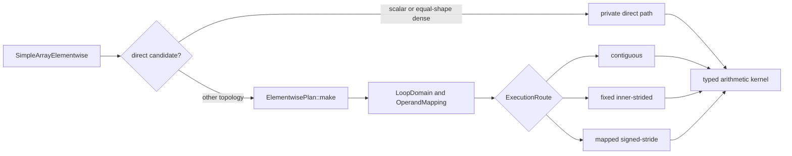

# Elementwise Broadcast HPC Execution

## Scope and status

`SimpleArray` arithmetic currently accepts scalars or arrays with matching
shapes.  Important paths also assume linear storage.  Those restrictions
prevent general NumPy broadcasting and make negative, stepped, sparse, and
zero-stride layouts difficult to execute correctly and efficiently.

The prototype has two goals:

1. Validate NumPy-compatible arithmetic broadcasting across supported dtypes,
   shapes, aliases, and layouts.
2. Establish an internal plan-and-executor architecture with low-overhead HPC
   routes for common layouts and one general signed-stride fallback.

Private `_planned_*`, `_planned_*_to`, and `_planned_i*` Python methods expose
the prototype for differential testing and profiling.  Existing public
arithmetic methods remain unchanged until the design is reviewed and migrated.
The proposed migration is tracked in [fork issue #23][issue-23].

## Code boundaries

The existing public arithmetic templates live in
`cpp/solvcon/buffer/SimpleArray.hpp` and are bound from
`cpp/solvcon/buffer/pymod/wrap_SimpleArray.hpp`.  Array operands currently
require equal shapes before the legacy linear or SIMD routes run.

The shared runtime-rank vocabulary from upstream PR #1208 lives in
`cpp/solvcon/buffer/loop.hpp`:

- `LoopDomain` owns an iteration shape;
- `OperandMapping` owns signed element strides aligned to that domain;
- `MappedOffsetCursor` traverses logical coordinates.

These types do not own storage, dtype, arithmetic, allocation, or backend
policy.  Elementwise-specific broadcasting, signed spans, layout
classification, route selection, alias handling, and kernels remain in
`cpp/solvcon/buffer/elementwise/`.

## Architecture



`ElementwisePlan` right-aligns operand axes, validates broadcasting and fixed
destinations, represents broadcast axes with zero strides, selects an inner
axis, and chooses an execution route.  The generic route preserves logical
coordinates for arbitrary supported signed and sparse layouts.

`ElementwiseExecutor` owns compact result allocation, fixed-destination
validation, overlap safety, and dispatch.  Exact aliases reuse the destination
mapping.  A partially overlapping input is snapshotted before writes.  Sparse
broadcast results use compact storage instead of materialized expanded inputs.

Scalar and equal-shape dense calls use mandatory private direct checks before
planning.  Every unsupported combination falls back to the same validated
plan.  The direct path is deliberately narrow: it does not introduce a public
selector, platform branch, runtime operation object, or second broadcasting
model.

Typed kernels own arithmetic and hot-loop specialization.  Inner-strided
execution recognizes contiguous, scalar, fixed-stride, reversed, and constant
mappings.  Operation-independent coordinate facts remain separate from
operation-specific semantics and tuning.

## Implementation map

The prototype adds or uses the following components:

- `cpp/solvcon/buffer/loop.hpp` for runtime-rank domains and mappings;
- `elementwise/layout.hpp` for signed spans and layout policy;
- `elementwise/plan.hpp` and `plan.cpp` for broadcasting and route selection;
- `elementwise/kernel.hpp` for typed scalar, vector, and strided kernels;
- `elementwise/executor.hpp` for direct checks, allocation, aliases, and
  planned dispatch;
- `elementwise/SimpleArrayElementwise.hpp` for the operation-family facade;
- `pymod/wrap_SimpleArray_elementwise.hpp` for one-pass Python operand
  dispatch;
- `tests/test_elementwise_execution.py` and
  `gtests/test_nopython_elementwise.cpp` for behavior and route coverage;
- `profiling/profile_elementwise_broadcast.py` and related helpers for
  correctness catalogs, broad sweeps, stable sampling, and report merging.

The shared `loop.hpp` remains byte-identical to upstream base `8337f48a`,
which contains merged PR #1208.  Elementwise policy therefore consumes the
shared vocabulary without extending it.

## Correctness and performance methodology

The catalog separates topology, layout, dtype, value pattern, alias mode, and
operation from the selected implementation.  It covers `add`, `sub`, `mul`,
and `div`; normal, reused-output, and in-place execution; 13 scalar types;
valid and invalid broadcasting; empty axes; scalar and singleton operands;
mixed ranks; C, Fortran, permuted, reversed, stepped, offset, sparse, and
zero-stride layouts; and finite or IEEE values.

Correctness and timing are separate runs.  Every timed callable is prepared
before the timer starts.  Timed calls include planning, allocation when
applicable, alias checks, dispatch, and arithmetic.  Numerical-library thread
variables are set before importing NumPy.

The broad `matched` policy uses inexpensive repeated measurements for coverage
and tail discovery.  The `stable` policy is reserved for near-parity cases.  It
runs independent processes, creates fresh callables each round, performs
time-based warmup for every method and round, balances methods across timing
positions, and records every raw observation.

The NumPy 2.5.1 correctness catalog contains 3,134,108 rows with zero
unexpected values, exceptions, mutations, benchmark errors, or process
crashes.  Of the 1,465,004 arithmetic outcomes, 999,110 match NumPy, 440,748
are expected invalid-broadcast errors, and 25,146 retain the existing solvcon
complex IEEE division difference.

Broad performance is favorable but not universal:

| Platform and path | Cases | Win rate | Median NumPy / planned |
| --- | ---: | ---: | ---: |
| WSL2 normal | 33,368 | 98.23% | 1.800x |
| WSL2 reused output | 24,512 | 98.91% | 2.284x |
| Apple M1 normal | 33,368 | 94.49% | 1.480x |
| Apple M1 reused output | 24,512 | 97.56% | 1.865x |

An earlier fixed-order Apple observation reported 0.977x for one reused-output
case.  Balanced stable sampling classifies the same case near parity: 1.023x
normal and 1.032x reused-output medians, with process-round ranges crossing
1.0.  The detailed tables, environment, revisions, and raw archives are kept
in the [NumPy 2.5.1 evidence comment][evidence-comment].

Historical development removed extra NumPy-view extraction and added scalar
or equal-shape direct bypasses in the same comparison window.  It demonstrates
that the original complete call path lost many small non-broadcast cases, but
does not isolate the bypass alone.  The upstream plan therefore keeps the
direct path mandatory and requires isolated complete-call A/B profiles to
validate its narrow scope.

## Reproduction

The final Apple data measured revision `e4a1bf84`, whose core implementation
is byte-identical to implementation revision `0c03661f`.  The WSL2 broad run
measured core-equivalent revision `2310734c`.  Start from the Apple measured
revision rather than the later documentation head:

```bash
git fetch origin codex/prototype-elementwise-broadcast
git fetch upstream master
git checkout e4a1bf847da12c01f250c5b44103f28771011b1d
git status --porcelain
git merge-base --is-ancestor 2405ac2b HEAD
git diff --exit-code upstream/master -- cpp/solvcon/buffer/loop.hpp
git diff --exit-code 0c03661f -- cpp gtests solvcon
git rev-parse HEAD
```

The worktree must be clean and every guard must exit zero.  Use the project
devenv and system Python, not a virtual environment.  Build and record the
environment before importing NumPy into a benchmark process:

```bash
make BUILD_QT=OFF
export PYTHONPATH="$PWD:$PWD/profiling"
export OPENBLAS_NUM_THREADS=1
export OMP_NUM_THREADS=1
export MKL_NUM_THREADS=1
export VECLIB_MAXIMUM_THREADS=1
export NUMEXPR_NUM_THREADS=1
python3 -c 'import platform, numpy; print(platform.platform()); print(platform.machine()); print(numpy.__version__)'
```

Create a new result directory for every run.  Never overwrite or merge it with
an earlier run:

```bash
RESULT_DIR=profiling/results/elementwise-numpy251-YYYYMMDD-HHMMSS
test ! -e "$RESULT_DIR"
mkdir -p "$RESULT_DIR"
COMMON_ARGS="--catalog performance --implementation planned --timing matched --preallocated-output --record all --samples 5 --warmup 2 --target-ms 1 --progress-every 5000 --fail-on-bug --fail-on-benchmark-error"
python3 profiling/profile_elementwise_broadcast.py $COMMON_ARGS --size 32 --output "$RESULT_DIR/elementwise-layout.json"
python3 profiling/profile_elementwise_broadcast.py $COMMON_ARGS --lhs-layout c --rhs-layout c --rhs-layout scalar --output "$RESULT_DIR/elementwise-scaling-cc.json"
python3 profiling/profile_elementwise_broadcast.py $COMMON_ARGS --rhs-layout c --rhs-layout scalar --size 8 --size 128 --size 512 --output "$RESULT_DIR/elementwise-scaling-lhs.json"
python3 profiling/profile_elementwise_broadcast.py $COMMON_ARGS --lhs-layout c --size 8 --size 128 --size 512 --output "$RESULT_DIR/elementwise-scaling-rhs.json"
python3 profiling/profile_elementwise_broadcast.py $COMMON_ARGS --topology lhs-singleton-array --topology all-singleton-lhs --lhs-layout c --output "$RESULT_DIR/elementwise-singleton-lhs.json"
python3 profiling/profile_elementwise_broadcast.py $COMMON_ARGS --topology rhs-singleton-array --topology all-singleton-rhs --rhs-layout c --output "$RESULT_DIR/elementwise-singleton-rhs.json"
```

The six reports contain 54,432 raw rows and 49,152 unique identifiers after
documented first-occurrence deduplication.  Every status must be `ok`, and all
recorded revisions, dirty-state flags, NumPy versions, thread variables,
samples, warmups, targets, and filters must match the requested run.

Near-parity tails use `--timing stable`, never the broad `matched` policy.  The
final Apple n=512 protocol is:

```bash
python3 profiling/profile_elementwise_broadcast.py \
  --catalog performance --implementation planned --timing stable \
  --preallocated-output --record all --operation mul --dtype float32 \
  --mode out --topology all-singleton-rhs --lhs-layout step2-outer \
  --rhs-layout c --value-pattern finite --size 512 --samples 11 \
  --stable-processes 7 --stable-rounds 9 --target-ms 20 \
  --warmup-ms 50 --fail-on-bug --fail-on-benchmark-error \
  --output "$RESULT_DIR/final-stable-tail-n512.json"
```

Preserve every broad report, stable observation, log, environment record,
checksum, and manifest.  Do not delete outliers or compare WSL2 near-parity
tails directly with Apple until WSL2 reruns the stable policy.

## Evidence and artifacts

- [Fork tracking issue #23][issue-23]
- [Prototype draft PR #28][draft-pr]
- [NumPy 2.5.1 evidence comment][evidence-comment]
- [Final Apple audit comment][final-audit]
- [Final Apple raw archive][final-archive], SHA-256
  `2592bb0ceed9eeaf9f6c40a92b3c56e9cde6318fc0dc0cafafbbc41b6c7e5cb6`
- [Merged shared runtime-rank implementation, solvcon/solvcon#1208][pr-1208]
- [Related batched matmul HPC design, solvcon/solvcon#1172][issue-1172]

Immutable revisions:

- upstream base: `8337f48a`;
- upstream PR #1208 merge: `2405ac2b`;
- WSL2 broad evidence: `2310734c`;
- final core implementation: `0c03661f`;
- final Apple measured revision: `e4a1bf84`.

The exact current documentation head is recorded in the draft PR and evidence
comment because a commit cannot contain its own hash.

## Out of scope

- Replacing public arithmetic methods on the prototype branch before review.
- Comparison operators.
- Changing existing complex division semantics.
- Changing the public layout contract before migration.
- Moving operation-specific policy into the shared runtime-rank layer.
- Exposing plan, route, kernel, or backend selectors publicly.
- Claiming universal performance dominance over NumPy.

## Delivery status

- Branch: `codex/prototype-elementwise-broadcast`.
- The core implementation is frozen at `0c03661f`; later commits affect
  profiling, tests, documentation, and profiler failure handling.
- Apple verification passed the build, 256 C++ tests, 1,535 non-GUI Python
  tests with 1,100 subtests, 34 focused elementwise tests with 285 subtests,
  five SIMD tests with 48 subtests, full lint, and `git diff --check`.
- WSL2 verification passed 1,536 non-GUI Python tests, benchmark tests, stable
  success and failure probes, and full lint.
- Apple broad and stable NumPy 2.5.1 evidence is complete.  WSL2 stable
  sampling remains a migration-time requirement for comparable parity tails.
- The fork issue and draft PR remain publication controls; no upstream issue
  or PR is created by this prototype workflow.

[issue-23]: https://github.com/ThreeMonth03/solvcon/issues/23
[draft-pr]: https://github.com/ThreeMonth03/solvcon/pull/28
[evidence-comment]: https://github.com/ThreeMonth03/solvcon/issues/23#issuecomment-5156722528
[final-audit]: https://github.com/ThreeMonth03/solvcon/pull/28#issuecomment-5156411746
[final-archive]: https://github.com/user-attachments/files/30628902/elementwise-numpy251-macos-stable-20260802-145103.tar.gz
[pr-1208]: https://github.com/solvcon/solvcon/pull/1208
[issue-1172]: https://github.com/solvcon/solvcon/issues/1172

<!-- vim: set ft=markdown ff=unix fenc=utf8 et sw=2 ts=2 sts=2 tw=79: -->
