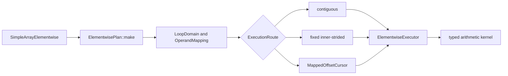

# Elementwise Broadcast Execution

## Problem

`SimpleArray` arithmetic currently combines API validation, traversal, and
arithmetic in each operation.  The implementation assumes matching shapes and
linear storage in important paths.  Those assumptions prevent general NumPy
broadcasting and make non-contiguous layouts difficult to optimize safely.

The prototype has two goals:

1. Cover arithmetic behavior broadly enough to separate traversal bugs,
   unsupported semantics, and performance opportunities.
2. Introduce a plan-and-executor architecture that can optimize common layouts
   without giving each operation its own traversal implementation.

The prototype adds private Python methods named `_planned_add`,
`_planned_sub`, `_planned_mul`, and `_planned_div`, with matching in-place
forms.  Existing public operators remain unchanged while the design is
evaluated.

## Code analysis

The existing arithmetic entry points are templates in
`cpp/solvcon/buffer/SimpleArray.hpp`.  Python exposes them from
`cpp/solvcon/buffer/pymod/wrap_SimpleArray.hpp`.  The legacy routes validate
shape equality and then either traverse linearly or call a SIMD helper.

That structure has three limitations:

- Shape equality cannot describe broadcasting.
- Linear traversal does not preserve logical coordinates for every signed or
  sparse stride layout.
- Adding a specialized broadcast loop would duplicate validation and
  traversal across arithmetic operations.

The elementwise-specific code lives in
`cpp/solvcon/buffer/elementwise/`.  Runtime-rank traversal is separated into
`cpp/solvcon/buffer/loop.hpp`, which owns the operation-independent domain,
operand mapping, signed span, and mapped cursor.  The elementwise planner owns
only broadcasting semantics, inner-axis selection, and execution routes.

## Benchmark coverage

The benchmark generator in `profiling/elementwise_benchmark_cases.py`
describes each case independently of an implementation.  A case selects:

- add, subtract, multiply, or divide;
- out-of-place or in-place execution;
- 13 scalar types;
- valid and invalid broadcast topologies, including mixed ranks, outer
  products, leading batches, crossed batches, scalar operands, singleton
  arrays, and empty axes;
- C-contiguous, permuted, negative-stride, stepped, offset, and zero-stride
  layouts;
- partial aliases and finite or IEEE value patterns.

The runner can audit legacy, legacy SIMD, and planned methods in isolated
processes.  Correctness and timing are separate modes.  NumPy in-place timing
uses a ufunc with `out=`, and out-of-place timing avoids an unnecessary dtype
copy.  Both NumPy and `SimpleArray` callables are bound before the timer
starts.  Large catalogs support deterministic shards, summary-only output,
and merging.

## Design



`LoopDomain` owns the broadcast result shape.  `OperandMapping` aligns
each operand to that domain and represents broadcasting with zero strides.
Its signed stride span also describes reversed layouts without changing the
logical origin.  `MappedOffsetCursor` provides the common runtime-rank
coordinate traversal.  None of these types knows about elementwise
arithmetic.

`ElementwisePlan` validates the fixed output shape and selects one of three
routes:

- `contiguous` for a shared dense traversal;
- `inner_strided` when one axis has fixed strides for each outer
  coordinate;
- `mapped` for the fully general signed-stride cursor.

`ElementwiseExecutor` owns output allocation, overlap handling, and route
dispatch.  A partially overlapping in-place source is snapshotted before
execution.  Dense layouts may be preserved, while sparse broadcast results
use compact C-contiguous storage.

The inner-axis selector prefers a unit output stride, then a small output
stride, while also rewarding zero or unit input strides.  This lets
Fortran-contiguous and permuted destinations use their dense direction
without making stepped destinations traverse a distant axis.

The operation kernels own only arithmetic semantics and hot loops.  The
selected inner loop recognizes common scalar, contiguous, and strided sides:

```text
output stride  lhs stride  rhs stride  specialization
      1             1           1      contiguous vectors
      1             1           0      vector op rhs scalar
      1             0           1      lhs scalar op vector
      1             0           0      compute once and fill
      1          strided        0      strided lhs op scalar
      1             0        strided   scalar op strided rhs
      1             1        strided   vector op strided rhs
      1          strided        1      strided lhs op vector
```

The last route is important for an outer broadcast shaped like `(rows, 1)` op
`(1, columns)`.  It hoists the left value out of the inner loop and lets the
compiler optimize a simple contiguous operation.

A mapping is constant when every non-singleton domain axis has zero stride.
If the other operand already has a dense result layout, out-of-place
execution preserves that layout and uses a full-domain contiguous scalar
kernel.  Singleton-axis strides are ignored when recognizing the constant
mapping.

An inner loop with output stride `-1` is traversed in physical order when all
varying inputs also have stride `-1` or `0`.  This preserves elementwise
pairing while reusing the positive contiguous kernels.  Exact in-place aliases
also share one offset when the other operand is constant, which avoids
maintaining duplicate loop state for stepped destinations.

## Implementation

The prototype adds:

- `loop.hpp` for operation-independent runtime-rank domains, mappings, spans,
  and cursors;
- `plan.hpp` and `plan.cpp` for broadcast mapping, inner-axis selection, and
  route selection;
- `kernel.hpp` for operation-specific scalar, vector, and broadcast loops;
- `executor.hpp` for allocation, alias safety, and dispatch;
- `SimpleArrayElementwise.hpp` for the operation-family facade;
- private pybind11 methods for side-by-side measurement;
- focused Python and no-Python C++ tests;
- catalog generation, execution, shard merging, and report rendering tools.

The new code uses `std::ranges::equal` when comparing shape and stride ranges.
This keeps the prototype independent of a known `small_vector` equality
defect in the current base revision.

## Verification

### Correctness catalog

The planned arithmetic path was audited against NumPy across 1,465,004 cases:

| Result | Cases |
| --- | ---: |
| Match | 999,110 |
| Expected invalid-broadcast error | 440,748 |
| Existing complex division semantic gap | 25,146 |
| Unexpected value or exception | 0 |

Complex division by zero currently raises from the existing solvcon complex
type, while NumPy produces IEEE `inf` or `nan`; the runner labels that
behavior explicitly instead of treating it as a traversal failure.

Focused verification also covers logical-coordinate traversal for contiguous,
Fortran, transposed, reversed, and stepped arrays; mixed-rank broadcasting;
empty domains; invalid fixed destinations; partial overlap; and compact
result allocation.

### Performance evidence

Measurements used WSL2 on x86-64, Python 3.12.7, NumPy 2.3.0, and one thread
for the common numerical-library environment variables.  All runs were
pinned to the same CPU.  Systematic runs used medians of five or seven samples
after two or three warmups.  The timer repeated each callable long enough to
reach a one- or five-millisecond target.  Suspicious extremes were repeated
with 15 samples, five warmups, and a 20-millisecond target.

The performance catalog contains 340,480 combinations, of which 233,128 are
valid under NumPy.  The release sweep covers every layout at size 32, every
left and right layout at sizes 8, 128, and 512, every catalog size from 1
through 1024 for C operands, and both singleton sides across all sizes and
layouts.  After duplicate identifiers are removed, revision `cb577c80` has
33,368 valid timed cases and all results match NumPy.

| Topology family | Cases | Win rate | Median NumPy / planned |
| --- | ---: | ---: | ---: |
| Non-broadcast | 4,160 | 99.13% | 2.02x |
| Python scalar | 672 | 96.58% | 2.27x |
| Singleton broadcast | 9,952 | 96.89% | 2.25x |
| Single-axis broadcast | 9,664 | 99.75% | 2.49x |
| Outer broadcast | 2,288 | 100.00% | 2.55x |
| Mixed-rank broadcast | 6,632 | 98.58% | 2.51x |
| All cases | 33,368 | 98.54% | 2.39x |

The original losses had two causes.  The benchmark's extra NumPy-view access
cost about 0.35 to 0.40 microseconds per planned call.  The executor also
built a broadcast plan for equal-shape dense arrays and scalar operations.
Equal-shape contiguous and dense-layout operations now use direct loops.
Rank-one signed-stride operations avoid a plan, disjoint backing storage is
rejected before logical-span analysis, and Python scalar overloads are tried
before array conversion.  A zero-stride scalar inner loop computes once and
fills the destination.  Reversible negative inner loops use the contiguous
kernels, dense full-shape operands keep their layout during broadcasting,
contiguous outputs specialize the remaining strided input, and exact
in-place aliases reuse one offset.

The broad sweep deliberately uses a one-millisecond timing target so tens of
thousands of cases remain practical.  Its tail is sensitive to scheduling.
The six lowest reported cases were repeated with 15 samples, five warmups,
and a 20-millisecond target.  All repeated at or above parity, from 1.00x to
1.49x.  A separate 50-millisecond diagnostic for the stride-2 in-place
singleton path measured 1.12x after the alias specialization.

A shared AVX2 array-and-scalar prototype was 1.8% slower in aggregate over 64
large C-layout cases, so it was removed rather than adding an unproven SIMD
layer.

### Reproduction

Build the extension and set every supported numerical library to one thread:

```bash
make
export PYTHONPATH="$PWD:$PWD/profiling"
export OPENBLAS_NUM_THREADS=1
export OMP_NUM_THREADS=1
export MKL_NUM_THREADS=1
export VECLIB_MAXIMUM_THREADS=1
export NUMEXPR_NUM_THREADS=1
```

The following commands reproduce the six performance reports.  Linux runs
may optionally prefix each command with `taskset -c 2`; macOS should run them
as written.

```bash
python3 profiling/profile_elementwise_broadcast.py --catalog performance --size 32 --implementation planned --timing matched --record all --samples 5 --warmup 2 --target-ms 1 --progress-every 5000 --fail-on-benchmark-error --output /tmp/elementwise-layout.json
python3 profiling/profile_elementwise_broadcast.py --catalog performance --lhs-layout c --rhs-layout c --rhs-layout scalar --implementation planned --timing matched --record all --samples 5 --warmup 2 --target-ms 1 --progress-every 5000 --fail-on-benchmark-error --output /tmp/elementwise-scaling-cc.json
python3 profiling/profile_elementwise_broadcast.py --catalog performance --rhs-layout c --rhs-layout scalar --size 8 --size 128 --size 512 --implementation planned --timing matched --record all --samples 5 --warmup 2 --target-ms 1 --progress-every 5000 --fail-on-benchmark-error --output /tmp/elementwise-scaling-lhs.json
python3 profiling/profile_elementwise_broadcast.py --catalog performance --lhs-layout c --size 8 --size 128 --size 512 --implementation planned --timing matched --record all --samples 5 --warmup 2 --target-ms 1 --progress-every 5000 --fail-on-benchmark-error --output /tmp/elementwise-scaling-rhs.json
python3 profiling/profile_elementwise_broadcast.py --catalog performance --topology lhs-singleton-array --topology all-singleton-lhs --lhs-layout c --implementation planned --timing matched --record all --samples 5 --warmup 2 --target-ms 1 --progress-every 5000 --fail-on-benchmark-error --output /tmp/elementwise-singleton-lhs.json
python3 profiling/profile_elementwise_broadcast.py --catalog performance --topology rhs-singleton-array --topology all-singleton-rhs --rhs-layout c --implementation planned --timing matched --record all --samples 5 --warmup 2 --target-ms 1 --progress-every 5000 --fail-on-benchmark-error --output /tmp/elementwise-singleton-rhs.json
```

Keep all six JSON files.  Each records the git revision, Python and NumPy
versions, platform, thread variables, case specification, correctness status,
and raw timing samples.

## Out of scope

- Replacing the existing public arithmetic methods before the prototype is
  reviewed.
- Comparison operators.
- Changing solvcon complex division semantics.
- Changing the public layout contract before the prototype is reviewed.
- Unifying operation-specific planning semantics beyond the common
  runtime-rank traversal layer.
- Claiming a universal performance advantage over NumPy.

## Delivery status

- Branch: `codex/prototype-elementwise-broadcast`
- Correctness catalog: complete
- C++ tests: 241 passed
- Python tests: 1,422 passed, 364 skipped, and 3 expected failures
- Performance specialization: complete for layout-selected inner loops,
  direct equal-shape and scalar loops, signed contiguous traversal, strided
  inputs, dense broadcast layouts, and exact aliases
- Benchmarked implementation revision: `cb577c80`
- Commits: split into benchmark, implementation, and documentation concerns
- CI: pending
- Documentation preview: blocked locally because Doxygen is not installed

## Chat history

1. The user asked to study the existing elementwise benchmark notes and use a
   broad benchmark, including broadcasting, before optimizing.
2. The user required independent bugs to be separated from the optimization
   work, following earlier shape and equality findings.
3. The user asked for a prototype architecture analogous to the current
   matrix-multiplication planner, followed by evidence before considering a
   shared layer.
4. The user approved implementing the architecture and asked for conditions
   where the planned path beats NumPy.
5. The user required performance evidence for non-broadcast execution and
   different layouts, not only outer broadcasting.
6. The user required investigation and optimization of the non-broadcast and
   Python scalar losses.
7. The user asked to align the prototype with the planner architecture used
   by matrix multiplication, rerun all correctness and performance evidence,
   and prepare a draft pull request with reproduction instructions.
8. The user plans to run the same six performance reports on a MacBook Air
   after the draft is ready.

<!-- vim: set ft=markdown ff=unix fenc=utf8 et sw=2 ts=2 sts=2 tw=79: -->
