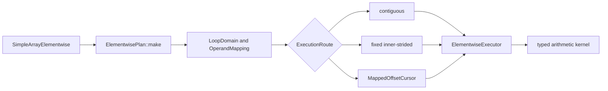

# Elementwise Broadcast Execution

## Problem

`SimpleArray` arithmetic currently combines API validation, traversal, and
arithmetic in each operation.  The implementation assumes matching shapes and
linear storage in important paths.  Those assumptions prevent general NumPy
broadcasting and make non-contiguous layouts difficult to optimize safely.

The prototype has two goals:

1. Cover arithmetic behavior broadly enough to separate traversal bugs,
   unsupported semantics, and performance opportunities.
2. Introduce a plan-and-executor architecture that can optimize common layouts
   without giving each operation its own traversal implementation.

The prototype adds private Python methods named `_planned_add`,
`_planned_sub`, `_planned_mul`, and `_planned_div`, with matching in-place
forms.  Existing public operators remain unchanged while the design is
evaluated.

## Code analysis

The existing arithmetic entry points are templates in
`cpp/solvcon/buffer/SimpleArray.hpp`.  Python exposes them from
`cpp/solvcon/buffer/pymod/wrap_SimpleArray.hpp`.  The legacy routes validate
shape equality and then either traverse linearly or call a SIMD helper.

That structure has three limitations:

- Shape equality cannot describe broadcasting.
- Linear traversal does not preserve logical coordinates for every signed or
  sparse stride layout.
- Adding a specialized broadcast loop would duplicate validation and
  traversal across arithmetic operations.

The elementwise-specific code lives in
`cpp/solvcon/buffer/elementwise/`.  Runtime-rank traversal is separated into
`cpp/solvcon/buffer/loop.hpp`, which owns the operation-independent domain,
operand mapping, and mapped cursor.  The elementwise layer owns signed spans,
layout classification, broadcasting semantics, inner-axis selection, and
execution routes.

## Benchmark coverage

The benchmark generator in `profiling/elementwise_benchmark_cases.py`
describes each case independently of an implementation.  A case selects:

- add, subtract, multiply, or divide;
- out-of-place or in-place execution;
- 13 scalar types;
- valid and invalid broadcast topologies, including mixed ranks, outer
  products, leading batches, crossed batches, scalar operands, singleton
  arrays, and empty axes;
- C-contiguous, permuted, negative-stride, stepped, offset, and zero-stride
  layouts;
- partial aliases and finite or IEEE value patterns.

The runner can audit legacy, legacy SIMD, and planned methods in isolated
processes.  Correctness and timing are separate modes.  NumPy in-place timing
uses a ufunc with `out=`, and out-of-place timing avoids an unnecessary dtype
copy.  Both NumPy and `SimpleArray` callables are bound before the timer
starts.  Large catalogs support deterministic shards, summary-only output,
and merging.

## Design



`LoopDomain` owns the broadcast result shape.  `OperandMapping` aligns
each operand to that domain and represents broadcasting with zero strides.
`MappedOffsetCursor` provides the common runtime-rank coordinate traversal.
None of these types knows about elementwise arithmetic.  The private
elementwise layout layer computes signed spans and classifies row-major,
dense, and constant mappings.

`ElementwisePlan` validates the fixed output shape and selects one of three
routes:

- `contiguous` for a shared dense traversal;
- `inner_strided` when one axis has fixed strides for each outer
  coordinate;
- `mapped` for the fully general signed-stride cursor.

`ElementwiseExecutor` owns output allocation, overlap handling, and route
dispatch.  A partially overlapping in-place source is snapshotted before
execution.  Dense layouts may be preserved, while sparse broadcast results
use compact C-contiguous storage.

The inner-axis selector prefers a unit output stride, then a small output
stride, while also rewarding zero or unit input strides.  This lets
Fortran-contiguous and permuted destinations use their dense direction
without making stepped destinations traverse a distant axis.

The operation kernels own only arithmetic semantics and hot loops.  The
selected inner loop recognizes common scalar, contiguous, and strided sides:

```text
output stride  lhs stride  rhs stride  specialization
      1             1           1      contiguous vectors
      1             1           0      vector op rhs scalar
      1             0           1      lhs scalar op vector
      1             0           0      compute once and fill
      1          strided        0      strided lhs op scalar
      1             0        strided   scalar op strided rhs
      1             1        strided   vector op strided rhs
      1          strided        1      strided lhs op vector
```

The last route is important for an outer broadcast shaped like `(rows, 1)` op
`(1, columns)`.  It hoists the left value out of the inner loop and lets the
compiler optimize a simple contiguous operation.

A mapping is constant when every non-singleton domain axis has zero stride.
If the other operand already has a dense result layout, out-of-place
execution preserves that layout and uses a full-domain contiguous scalar
kernel.  Singleton-axis strides are ignored when recognizing the constant
mapping.

An inner loop with output stride `-1` is traversed in physical order when all
varying inputs also have stride `-1` or `0`.  This preserves elementwise
pairing while reusing the positive contiguous kernels.  Exact in-place aliases
also share one offset when the other operand is constant, which avoids
maintaining duplicate loop state for stepped destinations.

## Implementation

The prototype adds:

- `loop.hpp` for operation-independent runtime-rank domains, mappings, and
  cursors;
- `elementwise/layout.hpp` for signed spans and elementwise layout policy;
- `plan.hpp` and `plan.cpp` for broadcast mapping, inner-axis selection, and
  route selection;
- `kernel.hpp` for operation-specific scalar, vector, and broadcast loops;
- `executor.hpp` for output allocation, alias safety, reused outputs, and
  dispatch;
- `SimpleArrayElementwise.hpp` for the operation-family facade;
- `wrap_SimpleArray_elementwise.hpp` for one-pass Python operand dispatch;
- private pybind11 methods for normal and reused-output measurement;
- focused Python and no-Python C++ tests;
- catalog generation, execution, shard merging, and report rendering tools.

The new code uses `std::ranges::equal` when comparing shape and stride ranges.
This keeps the prototype independent of a known `small_vector` equality
defect in the current base revision.

## Verification

### Correctness catalog

The planned arithmetic path was audited against NumPy across 1,465,004 cases:

| Result | Cases |
| --- | ---: |
| Match | 999,110 |
| Expected invalid-broadcast error | 440,748 |
| Existing complex division semantic gap | 25,146 |
| Unexpected value or exception | 0 |

Complex division by zero currently raises from the existing solvcon complex
type, while NumPy produces IEEE `inf` or `nan`; the runner labels that
behavior explicitly instead of treating it as a traversal failure.

Focused verification also covers logical-coordinate traversal for contiguous,
Fortran, transposed, reversed, and stepped arrays; mixed-rank broadcasting;
empty domains; invalid fixed destinations; partial overlap; and compact
result allocation.

### Performance evidence

Measurements used WSL2 on x86-64, Python 3.12.7, NumPy 2.3.0, and one thread
for the common numerical-library environment variables.  All runs were
pinned to the same CPU.  Systematic runs used medians of five or seven samples
after two or three warmups.  The timer repeated each callable long enough to
reach a one- or five-millisecond target.  Suspicious extremes were repeated
with 15 samples, five warmups, and a 20-millisecond target.

The performance catalog contains 340,480 combinations, of which 233,128 are
valid under NumPy.  The release sweep covers every layout at size 32, every
left and right layout at sizes 8, 128, and 512, every catalog size from 1
through 1024 for C operands, and both singleton sides across all sizes and
layouts.  After duplicate identifiers are removed, the shared-loop-aligned
prototype has 33,368 valid regular-output timings.  All results match NumPy.

| Topology family | Cases | Win rate | Median NumPy / planned |
| --- | ---: | ---: | ---: |
| Non-broadcast | 4,160 | 99.38% | 2.69x |
| Python scalar | 672 | 97.17% | 3.14x |
| Singleton broadcast | 9,952 | 97.02% | 2.70x |
| Single-axis broadcast | 9,664 | 99.74% | 2.97x |
| Outer broadcast | 2,288 | 100.00% | 3.11x |
| Mixed-rank broadcast | 6,632 | 98.64% | 2.89x |
| All cases | 33,368 | 98.63% | 2.86x |

The shared traversal header is byte-identical to upstream PR #1181 at
revision `48e77b31`.  It contains only `LoopDomain`, `OperandMapping`, and
`MappedOffsetCursor`.  Elementwise span and layout policy remains private in
`elementwise/layout.hpp`.  A direct row-major classifier avoids constructing
a temporary contiguous mapping and keeps the private policy inline.

An interleaved WSL2 A/B run compared the aligned code with clean revision
`b988fdc3` using matching Release builds.  The 288 regular cases and 168
reused-output cases cover seven topology families, sizes 1, 32, and 1,024,
four operations, and float32 and float64.  Median planned time improved by
4.24% for regular output and 3.81% for reused output.  NumPy-normalized
performance was 1.007x and 1.009x.

The full 49,152-identifier sweep reached the same conclusion.  Across 33,368
regular cases, median planned time improved by 2.0% and NumPy-normalized
performance was 1.007x.  Across 24,512 reused-output cases, planned time
improved by 2.5% and normalized performance was 1.010x.

The first Apple M1 report at revision `a42d5049` had a 0.89x median over the
same 33,368 case identifiers.  Paired cases separated the fixed cost from
the kernel: normal planned output had a 0.842x median while in-place planned
execution had a 1.024x median.  The loss was concentrated below 4,096 result
elements, while results with at least 65,536 elements had a 1.234x median.
The reused-output diagnostic records `numpy_to` and `planned_to` beside the
normal `numpy` and `planned` timings to separate allocation and return-object
cost from execution.

The original losses had two causes.  The benchmark's extra NumPy-view access
cost about 0.35 to 0.40 microseconds per planned call.  The executor also
built a broadcast plan for equal-shape dense arrays and scalar operations.
Equal-shape contiguous and dense-layout operations now use direct loops.
Rank-one signed-stride operations avoid a plan, disjoint backing storage is
rejected before logical-span analysis, and one Python binding dispatches
array and scalar operands without pybind11 overload retries.  A zero-stride
scalar inner loop computes once and fills the destination.  Reversible
negative inner loops use the contiguous kernels, dense full-shape operands
keep their layout during broadcasting, contiguous outputs specialize the
remaining strided input, and exact in-place aliases reuse one offset.

A 48-case x86-64 A/B run covered add, subtract, multiply, and divide for
float32 and float64, sizes 1, 32, and 1,024, and both equal-shape and Python
scalar operands.  The single-dispatch binding improved equal-shape medians by
1.21x to 1.30x.  Small float32 scalar medians improved by 1.68x to 1.84x,
and small float64 scalar medians improved by 1.03x.  AArch64 also treats NEON
as a compile-time architectural capability, removing one runtime feature
query from each contiguous kernel call.

The final Apple M1 run uses the same clean `b988fdc3` revision.  The regular
path beats NumPy in 72.23% of the 33,368 cases, with a 1.124x median ratio.
The reusable-output path wins 87.33% of 24,512 cases, with a 1.193x median.
Against revision `fd398e54`, NumPy-normalized performance improves by 1.037x
for regular output and 1.050x for reusable output.  The 64 through 255 result
element bucket is at measurement parity with a 0.998x median, so the evidence
does not justify a platform-specific route.

The aligned WSL2 sweep includes 24,512 reusable-output cases.  Planned
execution beats NumPy in 99.17% of them, with a 3.388x median NumPy/planned
ratio.  These timings validate the diagnostic path; they do not add reusable
output to the normal public result-returning API.

The broad sweep deliberately uses a one-millisecond timing target so tens of
thousands of cases remain practical.  Its tail is sensitive to scheduling.
The six lowest reported cases were repeated with 15 samples, five warmups,
and a 20-millisecond target.  Five repeated from 1.02x to 1.53x.  The
remaining float32 in-place division repeated at 0.85x, compared with 0.84x
before the executor refactor.  A 1,001-sample diagnostic measured the
stride-2 in-place singleton path at 1.10x.

The executor refactor was also compared directly with revision `cb577c80`
across 12 tail and representative cases.  The median old/new planned-time
ratio was 0.998, and the median ratio after normalization by the paired NumPy
measurement was 1.000.  The extracted helpers were fully inlined, and the
float binding text section was approximately 7 KB smaller.

A shared AVX2 array-and-scalar prototype was 1.8% slower in aggregate over 64
large C-layout cases, so it was removed rather than adding an unproven SIMD
layer.

### NumPy 2.5.1 refresh

The Apple M1 sweep was refreshed on 2026-07-31 after rebasing the measurements
on the updated prototype.  The clean `fdc3f567` revision used macOS 26.5.1
arm64, Python 3.14.6, NumPy 2.5.1, and one thread for every supported numerical
library variable.  The six reports contain 54,432 raw cases.  Deduplication
leaves 49,152 identifiers and 33,368 valid regular-output timings.  Every
valid result matches NumPy.

| Scope | Cases | Win rate | Median NumPy / planned | 10th percentile |
| --- | ---: | ---: | ---: | ---: |
| All regular output | 33,368 | 90.62% | 1.435x | 1.011x |
| Broadcast regular output | 29,208 | 93.20% | 1.454x | 1.065x |
| All reused output | 24,512 | 96.64% | 1.810x | 1.093x |
| Broadcast reused output | 22,240 | 97.36% | 1.836x | 1.250x |
| Size-32 regular output | 16,472 | 94.38% | 1.467x | 1.170x |
| Size-32 reused output | 12,384 | 97.69% | 1.823x | 1.395x |

Every topology has a median ratio above 1.0.  Against the `229960f1` size-32
baseline, the regular-output median increases from 1.139x to 1.467x and the
win rate increases from 85.02% to 94.38%.  The reused-output median increases
from 1.242x to 1.823x and the win rate increases from 95.88% to 97.69%.

The improvement comes from direct C- and Fortran-layout broadcast routes,
trailing-axis coalescing, standard contiguous result allocation, NEON scalar
kernels, and direct dense singleton-array updates.  The singleton path reads
an aliased value before mutation and recognizes a row-major destination with a
reversed inner axis, so it avoids overlap analysis and generic plan
construction without changing logical results.

The broad one-millisecond sweep recorded several scheduler-interrupted tail
samples.  The six lowest ratios were repeated sequentially with 31 samples,
seven warmups, and a 30-millisecond target.  Their NumPy/planned ratios range
from 1.242x to 2.146x.  These longer measurements confirm that the reported
extremes are timing noise rather than executor regressions.

### Reproduction

Build the extension and set every supported numerical library to one thread:

```bash
make
export PYTHONPATH="$PWD:$PWD/profiling"
export OPENBLAS_NUM_THREADS=1
export OMP_NUM_THREADS=1
export MKL_NUM_THREADS=1
export VECLIB_MAXIMUM_THREADS=1
export NUMEXPR_NUM_THREADS=1
```

The following commands reproduce the six performance reports.  Linux runs
may optionally prefix each command with `taskset -c 2`; macOS should run them
as written.

```bash
python3 profiling/profile_elementwise_broadcast.py --catalog performance --size 32 --implementation planned --timing matched --preallocated-output --record all --samples 5 --warmup 2 --target-ms 1 --progress-every 5000 --fail-on-benchmark-error --output /tmp/elementwise-layout.json
python3 profiling/profile_elementwise_broadcast.py --catalog performance --lhs-layout c --rhs-layout c --rhs-layout scalar --implementation planned --timing matched --preallocated-output --record all --samples 5 --warmup 2 --target-ms 1 --progress-every 5000 --fail-on-benchmark-error --output /tmp/elementwise-scaling-cc.json
python3 profiling/profile_elementwise_broadcast.py --catalog performance --rhs-layout c --rhs-layout scalar --size 8 --size 128 --size 512 --implementation planned --timing matched --preallocated-output --record all --samples 5 --warmup 2 --target-ms 1 --progress-every 5000 --fail-on-benchmark-error --output /tmp/elementwise-scaling-lhs.json
python3 profiling/profile_elementwise_broadcast.py --catalog performance --lhs-layout c --size 8 --size 128 --size 512 --implementation planned --timing matched --preallocated-output --record all --samples 5 --warmup 2 --target-ms 1 --progress-every 5000 --fail-on-benchmark-error --output /tmp/elementwise-scaling-rhs.json
python3 profiling/profile_elementwise_broadcast.py --catalog performance --topology lhs-singleton-array --topology all-singleton-lhs --lhs-layout c --implementation planned --timing matched --preallocated-output --record all --samples 5 --warmup 2 --target-ms 1 --progress-every 5000 --fail-on-benchmark-error --output /tmp/elementwise-singleton-lhs.json
python3 profiling/profile_elementwise_broadcast.py --catalog performance --topology rhs-singleton-array --topology all-singleton-rhs --rhs-layout c --implementation planned --timing matched --preallocated-output --record all --samples 5 --warmup 2 --target-ms 1 --progress-every 5000 --fail-on-benchmark-error --output /tmp/elementwise-singleton-rhs.json
```

Keep all six JSON files.  Each records the git revision, dirty-worktree state,
Python and NumPy versions, platform, thread variables, case specification,
correctness status, and raw timing samples.  Compare `numpy / planned` for the
normal API and `numpy_to / planned_to` for reused output.  If only the normal
API loses, the remaining gap is output allocation or return-object
construction.  If both lose for the same case families, profile the selected
executor route and kernel before changing allocation.

## Out of scope

- Replacing the existing public arithmetic methods before the prototype is
  reviewed.
- Comparison operators.
- Changing solvcon complex division semantics.
- Changing the public layout contract before the prototype is reviewed.
- Unifying operation-specific planning semantics beyond the common
  runtime-rank traversal layer.
- Claiming a universal performance advantage over NumPy.

## Delivery status

- Branch: `codex/prototype-elementwise-broadcast`
- Correctness catalog: complete
- C++ tests: 247 passed
- Python tests: 1,289 passed, 363 skipped, 3 expected failures, and 573
  subtests passed; seven unrelated files require the unavailable `jsonschema`
  dependency
- Performance specialization: complete for layout-selected inner loops,
  direct equal-shape and scalar loops, signed contiguous traversal, strided
  inputs, dense broadcast layouts, exact aliases, single Python operand
  dispatch, AArch64 feature resolution, and dense singleton-array updates
- Last clean broad benchmark revision: `fdc3f567`
- Cross-platform broad benchmarks: complete on WSL2 x86-64 and Apple M1
- Commits: split into benchmark, implementation, and documentation concerns
- Verification: full tests, focused elementwise tests, and `make lint` pass

<!-- vim: set ft=markdown ff=unix fenc=utf8 et sw=2 ts=2 sts=2 tw=79: -->
