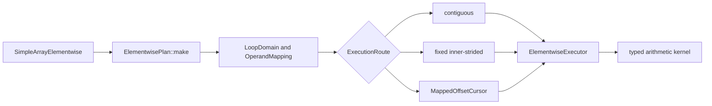

# Elementwise Broadcast Execution

## Problem

`SimpleArray` arithmetic currently combines API validation, traversal, and
arithmetic in each operation.  The implementation assumes matching shapes and
linear storage in important paths.  Those assumptions prevent general NumPy
broadcasting and make non-contiguous layouts difficult to optimize safely.

The prototype has two goals:

1. Cover arithmetic behavior broadly enough to separate traversal bugs,
   unsupported semantics, and performance opportunities.
2. Introduce a plan-and-executor architecture that can optimize common layouts
   without giving each operation its own traversal implementation.

The prototype adds private Python methods named `_planned_add`,
`_planned_sub`, `_planned_mul`, and `_planned_div`, with matching in-place
forms.  Existing public operators remain unchanged while the design is
evaluated.

## Code analysis

The existing arithmetic entry points are templates in
`cpp/solvcon/buffer/SimpleArray.hpp`.  Python exposes them from
`cpp/solvcon/buffer/pymod/wrap_SimpleArray.hpp`.  The legacy routes validate
shape equality and then either traverse linearly or call a SIMD helper.

That structure has three limitations:

- Shape equality cannot describe broadcasting.
- Linear traversal does not preserve logical coordinates for every signed or
  sparse stride layout.
- Adding a specialized broadcast loop would duplicate validation and
  traversal across arithmetic operations.

The elementwise-specific code lives in
`cpp/solvcon/buffer/elementwise/`.  Runtime-rank traversal is separated into
`cpp/solvcon/buffer/loop.hpp`, which owns the operation-independent domain,
operand mapping, and mapped cursor.  The elementwise layer owns signed spans,
layout classification, broadcasting semantics, inner-axis selection, and
execution routes.

## Benchmark coverage

The benchmark generator in `profiling/elementwise_benchmark_cases.py`
describes each case independently of an implementation.  A case selects:

- add, subtract, multiply, or divide;
- out-of-place or in-place execution;
- 13 scalar types;
- valid and invalid broadcast topologies, including mixed ranks, outer
  products, leading batches, crossed batches, scalar operands, singleton
  arrays, and empty axes;
- C-contiguous, permuted, negative-stride, stepped, offset, and zero-stride
  layouts;
- partial aliases and finite or IEEE value patterns.

The runner can audit legacy, legacy SIMD, and planned methods in isolated
processes.  Correctness and timing are separate modes.  NumPy in-place timing
uses a ufunc with `out=`, and out-of-place timing avoids an unnecessary dtype
copy.  Both NumPy and `SimpleArray` callables are bound before the timer
starts.  Large catalogs support deterministic shards, summary-only output,
and merging.

## Design



`LoopDomain` owns the broadcast result shape.  `OperandMapping` aligns
each operand to that domain and represents broadcasting with zero strides.
`MappedOffsetCursor` provides the common runtime-rank coordinate traversal.
None of these types knows about elementwise arithmetic.  The private
elementwise layout layer computes signed spans and classifies row-major,
dense, and constant mappings.

`ElementwisePlan` validates the fixed output shape and selects one of three
routes:

- `contiguous` for a shared dense traversal;
- `inner_strided` when one axis has fixed strides for each outer
  coordinate;
- `mapped` for the fully general signed-stride cursor.

`ElementwiseExecutor` owns output allocation, overlap handling, and route
dispatch.  A partially overlapping in-place source is snapshotted before
execution.  Dense layouts may be preserved, while sparse broadcast results
use compact C-contiguous storage.

The inner-axis selector prefers a unit output stride, then a small output
stride, while also rewarding zero or unit input strides.  This lets
Fortran-contiguous and permuted destinations use their dense direction
without making stepped destinations traverse a distant axis.

The operation kernels own only arithmetic semantics and hot loops.  The
selected inner loop recognizes common scalar, contiguous, and strided sides:

```text
output stride  lhs stride  rhs stride  specialization
      1             1           1      contiguous vectors
      1             1           0      vector op rhs scalar
      1             0           1      lhs scalar op vector
      1             0           0      compute once and fill
      1          strided        0      strided lhs op scalar
      1             0        strided   scalar op strided rhs
      1             1        strided   vector op strided rhs
      1          strided        1      strided lhs op vector
```

The last route is important for an outer broadcast shaped like `(rows, 1)` op
`(1, columns)`.  It hoists the left value out of the inner loop and lets the
compiler optimize a simple contiguous operation.

A mapping is constant when every non-singleton domain axis has zero stride.
If the other operand already has a dense result layout, out-of-place
execution preserves that layout and uses a full-domain contiguous scalar
kernel.  Singleton-axis strides are ignored when recognizing the constant
mapping.

An inner loop with output stride `-1` is traversed in physical order when all
varying inputs also have stride `-1` or `0`.  This preserves elementwise
pairing while reusing the positive contiguous kernels.  Exact in-place aliases
also share one offset when the other operand is constant, which avoids
maintaining duplicate loop state for stepped destinations.

## Implementation

The prototype adds:

- `loop.hpp` for operation-independent runtime-rank domains, mappings, and
  cursors;
- `elementwise/layout.hpp` for signed spans and elementwise layout policy;
- `plan.hpp` and `plan.cpp` for broadcast mapping, inner-axis selection, and
  route selection;
- `kernel.hpp` for operation-specific scalar, vector, and broadcast loops;
- `executor.hpp` for output allocation, alias safety, reused outputs, and
  dispatch;
- `SimpleArrayElementwise.hpp` for the operation-family facade;
- `wrap_SimpleArray_elementwise.hpp` for one-pass Python operand dispatch;
- private pybind11 methods for normal and reused-output measurement;
- focused Python and no-Python C++ tests;
- catalog generation, execution, shard merging, and report rendering tools.

The new code uses `std::ranges::equal` when comparing shape and stride ranges.
This keeps the prototype independent of a known `small_vector` equality
defect in the current base revision.

## Verification

### Rebase baseline

This revision is based on `upstream/master` at `8337f48a`.  The merge commit
for upstream PR #1208, `2405ac2b`, is an ancestor.  The shared
`cpp/solvcon/buffer/loop.hpp` is byte-identical to `upstream/master`.
Elementwise span, layout, and route policy remains in
`cpp/solvcon/buffer/elementwise/layout.hpp` instead of extending the shared
loop layer.

The code revision used for the current WSL2 correctness and performance data
is `2310734c`.  Later documentation-only commits do not change that code
baseline.  A rerun must verify both the upstream ancestor and the relevant
source diff before accepting its data.

### Correctness catalog

The complete correctness runner processed 3,134,108 rows at clean revision
`2310734c` with NumPy 2.5.1.  Every row had overall status `ok`.  Comparison
operations account for 1,669,104 unavailable rows because this prototype
only implements arithmetic.  The 1,465,004 arithmetic outcomes are:

| Planned result | Cases |
| --- | ---: |
| Match | 999,110 |
| Expected invalid-broadcast error | 440,748 |
| Existing complex IEEE division gap | 25,146 |
| Unexpected value or exception | 0 |

This run includes empty domains.  The executor now returns before selecting
an execution route when the validated output has zero elements, so the old
empty-result `SIGFPE` is not present.  Complex division by zero still raises
from the existing solvcon complex type while NumPy produces IEEE `inf` or
`nan`; the runner labels that behavior explicitly.

### Current WSL2 performance evidence

The authoritative x86-64 run used clean revision `2310734c`, WSL2, Python
3.12.7, NumPy 2.5.1, CPU 2, and one thread for every recorded numerical
library variable.  Each systematic case used five samples, two warmups, and
a one-millisecond timing target.

The six reports contain 54,432 raw rows.  Retaining the first occurrence in
the documented report order removes 5,280 overlaps and leaves 49,152 unique
identifiers.  All identifiers have overall status `ok`.  There are 33,368
valid normal-path timings and 24,512 valid reused-output timings.

| Scope | Cases | Win rate | Median NumPy / planned | 10th percentile |
| --- | ---: | ---: | ---: | ---: |
| All normal paths | 33,368 | 98.23% | 1.800x | 1.295x |
| Broadcast normal paths | 29,208 | 98.14% | 1.829x | 1.374x |
| All reused outputs | 24,512 | 98.91% | 2.284x | 1.385x |
| Broadcast reused outputs | 22,240 | 98.86% | 2.321x | 1.582x |
| Size-32 normal paths | 16,472 | 99.81% | 1.817x | 1.451x |
| Size-32 reused outputs | 12,384 | 99.99% | 2.283x | 1.746x |

| Topology family | Cases | Win rate | Median NumPy / planned |
| --- | ---: | ---: | ---: |
| Non-broadcast | 4,160 | 98.82% | 1.583x |
| Python scalar | 672 | 95.09% | 1.659x |
| Singleton broadcast | 9,952 | 96.03% | 1.663x |
| Single-axis broadcast | 9,664 | 99.66% | 1.837x |
| Outer broadcast | 2,288 | 99.96% | 2.069x |
| Mixed-rank broadcast | 6,632 | 98.79% | 1.937x |

The result supports a broad performance advantage, not a universal one.  The
six lowest short-sweep normal ratios were repeated sequentially with 31
samples, seven warmups, and a 30-millisecond target.  Their normal-path
ratios range from 0.804x to 1.593x.  Three remain slightly or materially
below 1.0, so the issue must not claim that every case beats NumPy.

### Superseded Apple data

The earlier Apple M1 NumPy 2.5.1 report used pre-rebase revision `fdc3f567`.
It is historical evidence only.  It must not be copied into the final issue
or compared directly with the current WSL2 result.  Apple data is pending a
fresh run from the rebased fork draft PR.

### Reproduction and macOS handoff

Start from the fork draft PR branch.  Do not start from a similarly named
local branch or from the old Apple revision.  Before building, fetch upstream
and run these guards:

```bash
git fetch upstream master
git status --porcelain
git merge-base --is-ancestor 2405ac2b HEAD
git diff --exit-code upstream/master -- cpp/solvcon/buffer/loop.hpp
git diff --exit-code 2310734c -- cpp gtests profiling solvcon tests
git rev-parse HEAD
```

The first command must print nothing and the next three commands must exit
zero.  Record the final `git rev-parse HEAD` output.  It is the revision that
must appear in every new JSON report.  Use the project devenv and system
Python, not a virtual environment.  Then build and verify the environment:

```bash
make BUILD_QT=OFF
export PYTHONPATH="$PWD:$PWD/profiling"
export OPENBLAS_NUM_THREADS=1
export OMP_NUM_THREADS=1
export MKL_NUM_THREADS=1
export VECLIB_MAXIMUM_THREADS=1
export NUMEXPR_NUM_THREADS=1
python3 -c 'import platform, numpy; print(platform.platform()); print(platform.machine()); print(numpy.__version__)'
```

The macOS run is acceptable only when the machine is `arm64`, NumPy is
`2.5.1`, and all five thread variables are recorded as `1`.  Create a new
result directory.  Never overwrite or merge it with a pre-rebase directory.

```bash
RESULT_DIR=profiling/results/elementwise-numpy251-macos-rebased-YYYYMMDD
test ! -e "$RESULT_DIR"
mkdir -p "$RESULT_DIR"
COMMON_ARGS="--catalog performance --implementation planned --timing matched --preallocated-output --record all --samples 5 --warmup 2 --target-ms 1 --progress-every 5000 --fail-on-bug --fail-on-benchmark-error"
python3 profiling/profile_elementwise_broadcast.py $COMMON_ARGS --size 32 --output "$RESULT_DIR/elementwise-layout.json"
python3 profiling/profile_elementwise_broadcast.py $COMMON_ARGS --lhs-layout c --rhs-layout c --rhs-layout scalar --output "$RESULT_DIR/elementwise-scaling-cc.json"
python3 profiling/profile_elementwise_broadcast.py $COMMON_ARGS --rhs-layout c --rhs-layout scalar --size 8 --size 128 --size 512 --output "$RESULT_DIR/elementwise-scaling-lhs.json"
python3 profiling/profile_elementwise_broadcast.py $COMMON_ARGS --lhs-layout c --size 8 --size 128 --size 512 --output "$RESULT_DIR/elementwise-scaling-rhs.json"
python3 profiling/profile_elementwise_broadcast.py $COMMON_ARGS --topology lhs-singleton-array --topology all-singleton-lhs --lhs-layout c --output "$RESULT_DIR/elementwise-singleton-lhs.json"
python3 profiling/profile_elementwise_broadcast.py $COMMON_ARGS --topology rhs-singleton-array --topology all-singleton-rhs --rhs-layout c --output "$RESULT_DIR/elementwise-singleton-rhs.json"
```

Check the six report counts in that order: 24,320, 4,928, 8,448, 9,120,
4,032, and 3,584.  Their raw total must be 54,432, first-occurrence
deduplication must leave 49,152 identifiers, normal timing must contain
33,368 cases, and reused-output timing must contain 24,512 cases.  Every
overall status must be `ok`; `revision`, `git_dirty`, NumPy, thread variables,
samples, warmups, target, and filters must match the run above.

Long-sample tail reruns must be selected from the new macOS short sweep.  Do
not reuse the WSL2 tail ratios as Apple measurements.  Preserve all six raw
reports and the selected tail reports for review.

### Draft publication order

Open the fork draft PR first and copy the URL returned by GitHub.  The fork PR
targets `ThreeMonth03/solvcon:master` and must not link back to an upstream
issue.  Only then replace the PR placeholder in the upstream issue draft with
that exact URL.  Keep the issue as a local draft until the rebased macOS
results pass the gates above.  Never guess the PR number or reuse a URL from
another prototype.

## Out of scope

- Replacing the existing public arithmetic methods before the prototype is
  reviewed.
- Comparison operators.
- Changing solvcon complex division semantics.
- Changing the public layout contract before the prototype is reviewed.
- Unifying operation-specific planning semantics beyond the common
  runtime-rank traversal layer.
- Claiming a universal performance advantage over NumPy.

## Delivery status

- Branch: `codex/prototype-elementwise-broadcast`
- Upstream base: `8337f48a`, including PR #1208 merge `2405ac2b`
- Current benchmark code revision: `2310734c`
- Correctness catalog: 3,134,108 overall `ok`; 1,465,004 arithmetic
  outcomes audited
- C++ tests: 256 passed
- Focused Python tests: 89 passed
- Non-GUI Python tests: 1,530 passed, 284 skipped, 3 expected failures,
  and one known callback warning
- Performance specialization: complete for layout-selected inner loops,
  direct equal-shape and scalar loops, signed contiguous traversal, strided
  inputs, dense broadcast layouts, exact aliases, single Python operand
  dispatch, AArch64 feature resolution, and dense singleton-array updates
- Rebased WSL2 NumPy 2.5.1 benchmark: complete and metadata-audited
- Rebased Apple NumPy 2.5.1 benchmark: pending macOS handoff
- Fork draft PR: pending review of its title and body
- Upstream issue draft: pending the exact fork draft PR URL and fresh Apple
  result
- Commits: split into benchmark, implementation, and documentation concerns
- Verification: build, full C++ tests, focused and non-GUI Python tests, and
  `make lint` pass

<!-- vim: set ft=markdown ff=unix fenc=utf8 et sw=2 ts=2 sts=2 tw=79: -->
