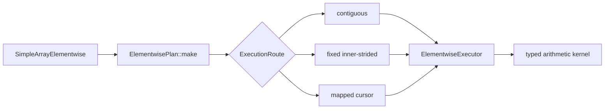

# Elementwise Broadcast Execution

## Problem

`SimpleArray` arithmetic currently combines API validation, traversal, and
arithmetic in each operation.  The implementation assumes matching shapes and
linear storage in important paths.  Those assumptions prevent general NumPy
broadcasting and make non-contiguous layouts difficult to optimize safely.

The prototype has two goals:

1. Cover arithmetic behavior broadly enough to separate traversal bugs,
   unsupported semantics, and performance opportunities.
2. Introduce a plan-and-executor architecture that can optimize common layouts
   without giving each operation its own traversal implementation.

The prototype adds private Python methods named `_planned_add`,
`_planned_sub`, `_planned_mul`, and `_planned_div`, with matching in-place
forms.  Existing public operators remain unchanged while the design is
evaluated.

## Code analysis

The existing arithmetic entry points are templates in
`cpp/solvcon/buffer/SimpleArray.hpp`.  Python exposes them from
`cpp/solvcon/buffer/pymod/wrap_SimpleArray.hpp`.  The legacy routes validate
shape equality and then either traverse linearly or call a SIMD helper.

That structure has three limitations:

- Shape equality cannot describe broadcasting.
- Linear traversal does not preserve logical coordinates for every signed or
  sparse stride layout.
- Adding a specialized broadcast loop would duplicate validation and
  traversal across arithmetic operations.

The new implementation is local to
`cpp/solvcon/buffer/elementwise/`.  It does not introduce a shared layer with
matrix multiplication yet.  The two operation families have similar planning
shapes, but their reusable abstractions should be extracted only after both
designs have stable evidence.

## Benchmark coverage

The benchmark generator in `profiling/elementwise_benchmark_cases.py`
describes each case independently of an implementation.  A case selects:

- add, subtract, multiply, or divide;
- out-of-place or in-place execution;
- 13 scalar types;
- valid and invalid broadcast topologies, including mixed ranks, outer
  products, leading batches, crossed batches, scalar operands, singleton
  arrays, and empty axes;
- C-contiguous, permuted, negative-stride, stepped, offset, and zero-stride
  layouts;
- partial aliases and finite or IEEE value patterns.

The runner can audit legacy, legacy SIMD, and planned methods in isolated
processes.  Correctness and timing are separate modes.  NumPy in-place timing
uses a ufunc with `out=`, and out-of-place timing avoids an unnecessary dtype
copy.  Both NumPy and `SimpleArray` callables are bound before the timer
starts.  Large catalogs support deterministic shards, summary-only output,
and merging.

## Design



`IterationDomain` owns the broadcast result shape.  `OperandMapping` aligns
each operand to that domain and represents broadcasting with zero strides.
Its signed stride span also describes reversed layouts without changing the
logical origin.

`ElementwisePlan` validates the fixed output shape and selects one of three
routes:

- `contiguous` for a shared dense traversal;
- `inner_strided` when the last-axis strides are fixed for each outer
  coordinate;
- `mapped` for the fully general signed-stride cursor.

`ElementwiseExecutor` owns output allocation, overlap handling, and route
dispatch.  A partially overlapping in-place source is snapshotted before
execution.  Dense layouts may be preserved, while sparse broadcast results
use compact C-contiguous storage.

The operation kernels own only arithmetic semantics and hot loops.  The fixed
inner loop recognizes both common scalar sides:

```text
output stride  lhs stride  rhs stride  specialization
      1             1           1      contiguous vectors
      1             1           0      vector op rhs scalar
      1             0           1      lhs scalar op vector
```

The last route is important for an outer broadcast shaped like `(rows, 1)` op
`(1, columns)`.  It hoists the left value out of the inner loop and lets the
compiler optimize a simple contiguous operation.

## Implementation

The prototype adds:

- `plan.hpp` and `plan.cpp` for broadcast domains, mappings, cursors, and
  route selection;
- `kernel.hpp` for operation-specific scalar, vector, and broadcast loops;
- `executor.hpp` for allocation, alias safety, and dispatch;
- `SimpleArrayElementwise.hpp` for the operation-family facade;
- private pybind11 methods for side-by-side measurement;
- focused Python and no-Python C++ tests;
- catalog generation, execution, shard merging, and report rendering tools.

The new code uses `std::ranges::equal` when comparing shape and stride ranges.
This keeps the prototype independent of a known `small_vector` equality
defect in the current base revision.

## Verification

### Correctness catalog

The planned arithmetic path was audited against NumPy across 1,465,004 cases:

| Result | Cases |
| --- | ---: |
| Match | 923,672 |
| Expected invalid-broadcast error | 411,642 |
| Existing array-construction defect | 104,544 |
| Existing complex division semantic gap | 25,146 |
| Unexpected value or exception | 0 |

The construction failures occur before elementwise execution and are retained
as a separate benchmark finding.  Complex division by zero currently raises
from the existing solvcon complex type, while NumPy produces IEEE `inf` or
`nan`; the runner labels that behavior explicitly instead of treating it as a
traversal failure.

Focused verification also covers logical-coordinate traversal for contiguous,
Fortran, transposed, reversed, and stepped arrays; mixed-rank broadcasting;
empty domains; invalid fixed destinations; partial overlap; and compact
result allocation.

### Performance evidence

Measurements used WSL2 on x86-64, Python 3.12.7, NumPy 2.3.0, and one thread
for the common numerical-library environment variables.  Each reported value
is the median of 15 samples after five warmups.

For C-contiguous outer broadcasting, add and multiply were measured at sizes
32, 128, and 512 for `float32` and `float64`.  The planned path was faster
than NumPy in all 12 cases:

| Size | NumPy / planned range |
| ---: | ---: |
| 32 | 1.72x to 1.79x |
| 128 | 2.61x to 3.21x |
| 512 | 3.71x to 5.02x |

The best measured case was `float64` multiplication at size 512, where the
planned path was 5.02x faster than NumPy.  These numbers establish a useful
specialization, not a claim that the prototype wins for every layout or size.

## Out of scope

- Replacing the existing public arithmetic methods before the prototype is
  reviewed.
- Comparison operators.
- Changing solvcon complex division semantics.
- Fixing the independent `small_vector` construction or equality defects
  globally.
- Extracting a common planning layer with matrix multiplication before the
  two implementations expose a stable shared vocabulary.
- Claiming a universal performance advantage over NumPy.

## Delivery status

- Branch: `codex/prototype-elementwise-broadcast`
- Correctness catalog: complete
- Focused tests: complete
- Performance specialization: complete for contiguous inner broadcast loops
- Commits: split into benchmark, implementation, and documentation concerns
- CI: pending
- Documentation preview: blocked locally by missing Doxygen and Sphinx

## Chat history

1. The user asked to study the existing elementwise benchmark notes and use a
   broad benchmark, including broadcasting, before optimizing.
2. The user required independent bugs to be separated from the optimization
   work, following earlier shape and equality findings.
3. The user asked for a prototype architecture analogous to the current
   matrix-multiplication planner, followed by evidence before considering a
   shared layer.
4. The user approved implementing the architecture and asked for conditions
   where the planned path beats NumPy.

<!-- vim: set ft=markdown ff=unix fenc=utf8 et sw=2 ts=2 sts=2 tw=79: -->
