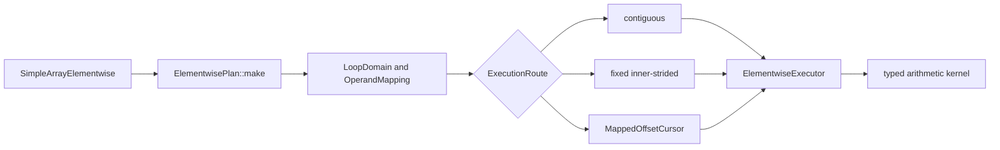

# Elementwise Broadcast Execution

## Problem

`SimpleArray` arithmetic currently combines API validation, traversal, and
arithmetic in each operation.  The implementation assumes matching shapes and
linear storage in important paths.  Those assumptions prevent general NumPy
broadcasting and make non-contiguous layouts difficult to optimize safely.

The prototype has two goals:

1. Cover arithmetic behavior broadly enough to separate traversal bugs,
   unsupported semantics, and performance opportunities.
2. Introduce a plan-and-executor architecture that can optimize common layouts
   without giving each operation its own traversal implementation.

The prototype adds private Python methods named `_planned_add`,
`_planned_sub`, `_planned_mul`, and `_planned_div`, with matching in-place
forms.  Existing public operators remain unchanged while the design is
evaluated.

## Code analysis

The existing arithmetic entry points are templates in
`cpp/solvcon/buffer/SimpleArray.hpp`.  Python exposes them from
`cpp/solvcon/buffer/pymod/wrap_SimpleArray.hpp`.  The legacy routes validate
shape equality and then either traverse linearly or call a SIMD helper.

That structure has three limitations:

- Shape equality cannot describe broadcasting.
- Linear traversal does not preserve logical coordinates for every signed or
  sparse stride layout.
- Adding a specialized broadcast loop would duplicate validation and
  traversal across arithmetic operations.

The elementwise-specific code lives in
`cpp/solvcon/buffer/elementwise/`.  Runtime-rank traversal is separated into
`cpp/solvcon/buffer/loop.hpp`, which owns the operation-independent domain,
operand mapping, and mapped cursor.  The elementwise layer owns signed spans,
layout classification, broadcasting semantics, inner-axis selection, and
execution routes.

## Benchmark coverage

The benchmark generator in `profiling/elementwise_benchmark_cases.py`
describes each case independently of an implementation.  A case selects:

- add, subtract, multiply, or divide;
- out-of-place or in-place execution;
- 13 scalar types;
- valid and invalid broadcast topologies, including mixed ranks, outer
  products, leading batches, crossed batches, scalar operands, singleton
  arrays, and empty axes;
- C-contiguous, permuted, negative-stride, stepped, offset, and zero-stride
  layouts;
- partial aliases and finite or IEEE value patterns.

The runner can audit legacy, legacy SIMD, and planned methods in isolated
processes.  Correctness and timing are separate modes.  NumPy in-place timing
uses a ufunc with `out=`, and out-of-place timing avoids an unnecessary dtype
copy.  Both NumPy and `SimpleArray` callables are bound before the timer
starts.  Large catalogs support deterministic shards, summary-only output,
and merging.  The fast `matched` policy remains available for broad sweeps.
The `stable` policy runs independent child processes, uses time-based warmup
for every method and round, balances each method across timing positions, and
records every observation with its process, round, sequence, order, repeat,
elapsed time, and per-call time.

## Design



`LoopDomain` owns the broadcast result shape.  `OperandMapping` aligns
each operand to that domain and represents broadcasting with zero strides.
`MappedOffsetCursor` provides the common runtime-rank coordinate traversal.
None of these types knows about elementwise arithmetic.  The private
elementwise layout layer computes signed spans and classifies row-major,
dense, and constant mappings.

`ElementwisePlan` validates the fixed output shape and selects one of three
routes:

- `contiguous` for a shared dense traversal;
- `inner_strided` when one axis has fixed strides for each outer
  coordinate;
- `mapped` for the fully general signed-stride cursor.

`ElementwiseExecutor` owns output allocation, overlap handling, and route
dispatch.  A partially overlapping in-place source is snapshotted before
execution.  Dense layouts may be preserved, while sparse broadcast results
use compact C-contiguous storage.

The inner-axis selector prefers a unit output stride, then a small output
stride, while also rewarding zero or unit input strides.  This lets
Fortran-contiguous and permuted destinations use their dense direction
without making stepped destinations traverse a distant axis.

The operation kernels own only arithmetic semantics and hot loops.  The
selected inner loop recognizes common scalar, contiguous, and strided sides:

```text
output stride  lhs stride  rhs stride  specialization
      1             1           1      contiguous vectors
      1             1           0      vector op rhs scalar
      1             0           1      lhs scalar op vector
      1             0           0      compute once and fill
      1          strided        0      strided lhs op scalar
      1             0        strided   scalar op strided rhs
      1             1        strided   vector op strided rhs
      1          strided        1      strided lhs op vector
```

The last route is important for an outer broadcast shaped like `(rows, 1)` op
`(1, columns)`.  It hoists the left value out of the inner loop and lets the
compiler optimize a simple contiguous operation.

A mapping is constant when every non-singleton domain axis has zero stride.
If the other operand already has a dense result layout, out-of-place
execution preserves that layout and uses a full-domain contiguous scalar
kernel.  Singleton-axis strides are ignored when recognizing the constant
mapping.

An inner loop with output stride `-1` is traversed in physical order when all
varying inputs also have stride `-1` or `0`.  This preserves elementwise
pairing while reusing the positive contiguous kernels.  Exact in-place aliases
also share one offset when the other operand is constant, which avoids
maintaining duplicate loop state for stepped destinations.

## Implementation

The prototype adds:

- `loop.hpp` for operation-independent runtime-rank domains, mappings, and
  cursors;
- `elementwise/layout.hpp` for signed spans and elementwise layout policy;
- `plan.hpp` and `plan.cpp` for broadcast mapping, inner-axis selection, and
  route selection;
- `kernel.hpp` for operation-specific scalar, vector, and broadcast loops;
- `executor.hpp` for output allocation, alias safety, reused outputs, and
  dispatch;
- `SimpleArrayElementwise.hpp` for the operation-family facade;
- `wrap_SimpleArray_elementwise.hpp` for one-pass Python operand dispatch;
- private pybind11 methods for normal and reused-output measurement;
- focused Python and no-Python C++ tests;
- catalog generation, execution, shard merging, and report rendering tools.

The new code uses `std::ranges::equal` when comparing shape and stride ranges.
This keeps the prototype independent of a known `small_vector` equality
defect in the current base revision.

## Verification

### Rebase baseline

This revision is based on `upstream/master` at `8337f48a`.  The merge commit
for upstream PR #1208, `2405ac2b`, is an ancestor.  The shared
`cpp/solvcon/buffer/loop.hpp` is byte-identical to `upstream/master`.
Elementwise span, layout, and route policy remains in
`cpp/solvcon/buffer/elementwise/layout.hpp` instead of extending the shared
loop layer.

The implementation baseline is clean revision `0c03661f`, which includes the
NEON scalar-loop change.  The final implementation remains byte-identical to
that revision in `cpp/`, `gtests/`, and `solvcon/`.  Clean revision
`e4a1bf84` adds only the reusable stable timing policy and its Python tests;
it is the measured revision for the final Apple data.  Later commits update
documentation and harden profiler failure handling.  They do not change the
successful timing order, warmup, sampling, or statistics.  The exact current
head is recorded in Draft PR #28 because a commit cannot contain its own hash.

The WSL2 correctness and broad performance data remain tied to clean revision
`2310734c`.  The core implementation did not change, so those results are
still implementation evidence.  WSL2 must nevertheless rerun the new stable
tail policy before its near-parity cases are compared directly with the final
Apple stable data.

### Correctness catalog

The complete correctness runner processed 3,134,108 rows with NumPy 2.5.1 at
both the WSL2 anchor `2310734c` and the final Apple measured revision
`e4a1bf84`.  Every row had overall status `ok`.  Comparison operations
account for 1,669,104 unavailable rows because this prototype only implements
arithmetic.  The 1,465,004 arithmetic outcomes are:

| Planned result | Cases |
| --- | ---: |
| Match | 999,110 |
| Expected invalid-broadcast error | 440,748 |
| Existing complex IEEE division gap | 25,146 |
| Unexpected value or exception | 0 |

This run includes empty domains.  The executor now returns before selecting
an execution route when the validated output has zero elements, so the old
empty-result `SIGFPE` is not present.  Complex division by zero still raises
from the existing solvcon complex type while NumPy produces IEEE `inf` or
`nan`; the runner labels that behavior explicitly.

### Current WSL2 performance evidence

The authoritative x86-64 run used clean revision `2310734c`, WSL2, Python
3.12.7, NumPy 2.5.1, CPU 2, and one thread for every recorded numerical
library variable.  Each systematic case used five samples, two warmups, and
a one-millisecond timing target.

The six reports contain 54,432 raw rows.  Retaining the first occurrence in
the documented report order removes 5,280 overlaps and leaves 49,152 unique
identifiers.  All identifiers have overall status `ok`.  There are 33,368
valid normal-path timings and 24,512 valid reused-output timings.

| Scope | Cases | Win rate | Median NumPy / planned | 10th percentile |
| --- | ---: | ---: | ---: | ---: |
| All normal paths | 33,368 | 98.23% | 1.800x | 1.295x |
| Broadcast normal paths | 29,208 | 98.14% | 1.829x | 1.374x |
| All reused outputs | 24,512 | 98.91% | 2.284x | 1.385x |
| Broadcast reused outputs | 22,240 | 98.86% | 2.321x | 1.582x |
| Size-32 normal paths | 16,472 | 99.81% | 1.817x | 1.451x |
| Size-32 reused outputs | 12,384 | 99.99% | 2.283x | 1.746x |

| Topology family | Cases | Win rate | Median NumPy / planned |
| --- | ---: | ---: | ---: |
| Non-broadcast | 4,160 | 98.82% | 1.583x |
| Python scalar | 672 | 95.09% | 1.659x |
| Singleton broadcast | 9,952 | 96.03% | 1.663x |
| Single-axis broadcast | 9,664 | 99.66% | 1.837x |
| Outer broadcast | 2,288 | 99.96% | 2.069x |
| Mixed-rank broadcast | 6,632 | 98.79% | 1.937x |

The result supports a broad performance advantage, not a universal one.  The
six lowest short-sweep normal ratios were repeated sequentially with 31
samples, seven warmups, and a 30-millisecond target.  Their normal-path
ratios range from 0.804x to 1.593x.  Three remain slightly or materially
below 1.0, so the issue must not claim that every case beats NumPy.

### Final Apple Silicon performance evidence

The authoritative final Apple run used clean measured revision `e4a1bf84`.
The native environment was macOS 26.5.1 on Apple M1, native arm64, Python
3.14.6, NumPy 2.5.1 with Accelerate, and AC power.  The recorded
`OPENBLAS_NUM_THREADS`, `OMP_NUM_THREADS`, `MKL_NUM_THREADS`,
`VECLIB_MAXIMUM_THREADS`, and `NUMEXPR_NUM_THREADS` values were all `1` and
were set before importing NumPy.

The broad sweep keeps the affordable `matched` policy: five samples, two
warmups, a one-millisecond target, and preallocated-output timing.  The six
reports contain 24,320, 4,928, 8,448, 9,120, 4,032, and 3,584 rows.  Their
54,432 raw rows become 49,152 unique identifiers after first-occurrence
deduplication removes 5,280 overlaps.  Every unique status is `ok`.  The
deduplicated data contain 33,368 normal and 24,512 reused-output timings.

| Scope | Cases | Win rate | Median NumPy / planned | 10th percentile | Minimum |
| --- | ---: | ---: | ---: | ---: | ---: |
| All normal paths | 33,368 | 94.49% | 1.480x | 1.093x | 0.211x |
| Broadcast normal paths | 29,208 | 97.38% | 1.500x | 1.138x | 0.211x |
| All reused outputs | 24,512 | 97.56% | 1.865x | 1.146x | 0.323x |
| Broadcast reused outputs | 22,240 | 97.86% | 1.898x | 1.277x | 0.323x |

Broad matched timing is used for coverage and tail discovery.  It is not used
to decide a near-parity result.  The reusable stable policy instead launches
independent child processes, creates fresh callables each round, performs
time-based warmup for each method and round, and balances `numpy`, `planned`,
`numpy_to`, and `planned_to` across all four timing positions.  Every raw
observation records the process, round, sample, sequence, order, repeat,
elapsed nanoseconds, and per-call nanoseconds.

The exact case is:

```text
out/mul/float32/n512/all-singleton-rhs/step2-outer/c/none/finite
LHS shape (2, 257, 512), strides (263168, 512, 1)
RHS shape (1, 1, 1), strides (1, 1, 1)
```

The scaling run used 5 independent processes, 7 rounds per process, 9
samples per round, a 10-millisecond target, and 30 milliseconds of time-based
warmup per method and round:

| Size | Normal median and round range | Reused median and round range |
| ---: | ---: | ---: |
| 256 | 1.054x [0.960, 1.223] | 1.065x [0.955, 1.476] |
| 512 | 1.012x [0.840, 1.159] | 1.018x [0.844, 1.194] |
| 1024 | 1.005x [0.734, 1.074] | 1.009x [0.854, 1.149] |

The longer n=512 run used 7 independent processes, 9 rounds per process, 11
samples per round, a 20-millisecond target, and 50 milliseconds of time-based
warmup.  Its 63 process-round summaries contain 693 observations per
method.  Every method appears 173 or 174 times in every timing position.
Normal execution has a 1.023x median and [0.796, 1.281] round range.  Reused
output has a 1.032x median and [0.715, 1.153] round range.

Both round ranges cross 1.0, normal and reused execution move together, and
the same executor kernel handles both destinations after reused-output
validation.  Operation, dtype, mirrored singleton-side, and neighboring
layout runs show the same parity behavior for the step2-outer route.  They
also retain stable advantages for layouts with a general NumPy cost, such as
step2-inner at 3.149x normal and 3.197x reused, and offset at 1.508x normal
and 1.568x reused.

The exact route dispatches the array operand once in the Python binding,
builds an `ElementwisePlan`, recognizes the RHS mapping as constant, and
selects fixed inner-stride traversal on the unit-stride last axis.  Normal
execution allocates its compact result and then calls `execute_to`.
Reused-output execution validates the fixed destination and overlap safety
before calling the same `execute_to`.  Each row reaches the contiguous
multiply-by-scalar kernel, including the existing NEON transform and vector
tail handling.  No extra arithmetic route exists only for one destination.

The old 0.977x reused result is therefore a fixed-order timing artifact, not
a stable reused-output regression.  A same-implementation fixed-order rerun
flipped to 1.110x, while the balanced long run classifies the case as parity
with a small median planned edge.  There is no general, low-risk executor or
NEON gap to fix.  The core implementation and architecture remain unchanged;
only the reusable sampling harness and tests were added.

The final environment also passes all 3,134,108 correctness rows, the build,
256 C++ tests, 1,535 non-GUI Python tests with 1,100 subtests, 34 focused
elementwise tests with 285 subtests, 5 SIMD tests with 48 subtests, the full
lint target, and `git diff --check`.  There are 283 skips, three expected
failures, and one existing callback warning in the non-GUI Python run.

The [final audit comment][final-pr28-audit] links the immutable
[Apple archive][final-apple-archive].  Its SHA-256 is
`2592bb0ceed9eeaf9f6c40a92b3c56e9cde6318fc0dc0cafafbbc41b6c7e5cb6`.

[final-pr28-audit]: https://github.com/ThreeMonth03/solvcon/pull/28#issuecomment-5156411746
[final-apple-archive]: https://github.com/user-attachments/files/30628902/elementwise-numpy251-macos-stable-20260802-145103.tar.gz

### Superseded fixed-order Apple evidence

The following `0c03661f` result is retained only to explain the original
tail report.  Its broad sweep remains useful, but its sequential long-tail
policy must not be used for a near-parity conclusion.

This earlier Apple run used clean revision `0c03661f`.  The native
environment was macOS 26.5.1 on a MacBook Air with Apple M1, native arm64,
Python 3.14.6, NumPy 2.5.1 with Accelerate, and AC power.  The recorded
`OPENBLAS_NUM_THREADS`, `OMP_NUM_THREADS`, `MKL_NUM_THREADS`,
`VECLIB_MAXIMUM_THREADS`, and `NUMEXPR_NUM_THREADS` values were all `1`.
Each short-sweep case used five samples, two warmups, a one-millisecond timing
target, and preallocated-output timing.

The six reports contain 54,432 raw rows in the documented order: 24,320,
4,928, 8,448, 9,120, 4,032, and 3,584.  First-occurrence deduplication
removes 5,280 overlaps and leaves 49,152 unique identifiers, all with
overall status `ok`.  There are 33,368 valid normal-path timings and 24,512
valid reused-output timings.

| Scope | Cases | Win rate | Median NumPy / planned | 10th percentile | Minimum |
| --- | ---: | ---: | ---: | ---: | ---: |
| All normal paths | 33,368 | 94.49% | 1.498x | 1.091x | 0.128x |
| Broadcast normal paths | 29,208 | 97.48% | 1.522x | 1.138x | 0.128x |
| All reused outputs | 24,512 | 97.92% | 1.876x | 1.145x | 0.145x |
| Broadcast reused outputs | 22,240 | 98.04% | 1.906x | 1.281x | 0.145x |
| Size-32 normal paths | 16,472 | 95.80% | 1.541x | 1.246x | 0.128x |
| Size-32 reused outputs | 12,384 | 99.52% | 1.902x | 1.429x | 0.145x |

| Topology family | Path | Cases | Win rate | Median | 10th percentile | Minimum |
| --- | --- | ---: | ---: | ---: | ---: | ---: |
| Non-broadcast | Normal | 4,160 | 73.46% | 1.348x | 0.922x | 0.602x |
| Non-broadcast | Reused | 2,272 | 96.70% | 1.138x | 1.029x | 0.738x |
| Python scalar | Normal | 672 | 96.73% | 1.436x | 1.064x | 0.468x |
| Python scalar | Reused | 368 | 97.28% | 1.689x | 1.130x | 0.588x |
| Singleton broadcast | Normal | 9,952 | 95.82% | 1.403x | 1.070x | 0.319x |
| Singleton broadcast | Reused | 7,104 | 95.88% | 1.834x | 1.121x | 0.229x |
| Single-axis broadcast | Normal | 9,664 | 98.74% | 1.545x | 1.234x | 0.283x |
| Single-axis broadcast | Reused | 6,816 | 99.62% | 1.937x | 1.445x | 0.708x |
| Outer broadcast | Normal | 2,288 | 99.21% | 1.797x | 1.543x | 0.710x |
| Outer broadcast | Reused | 2,272 | 99.91% | 2.241x | 1.865x | 0.698x |
| Mixed-rank broadcast | Normal | 6,632 | 97.63% | 1.556x | 1.146x | 0.128x |
| Mixed-rank broadcast | Reused | 5,680 | 98.17% | 1.826x | 1.300x | 0.145x |

The six lowest short-sweep normal ratios were selected from this exact run and
rerun sequentially, one exact case at a time, with 31 samples, seven warmups,
and a 30-millisecond target.

| Case ID | Short normal | Long normal | Long reused |
| --- | ---: | ---: | ---: |
| `out/mul/float32/n32/mixed-rank-reversed/negative-inner/offset/none/finite` | 0.128x | 1.388x | 1.466x |
| `out/mul/float32/n32/mixed-rank-reversed/negative-inner/zero-inner/none/finite` | 0.167x | 1.208x | 1.439x |
| `out/mul/float32/n4/rhs-column/c/c/none/finite` | 0.283x | 1.332x | 2.195x |
| `out/mul/float32/n512/all-singleton-rhs/step2-outer/c/none/finite` | 0.319x | 1.095x | 0.977x |
| `out/mul/float32/n32/crossed-batch/zero-inner/zero-inner/none/finite` | 0.358x | 1.508x | 1.738x |
| `out/add/float64/n1024/python-scalar/c/scalar/none/finite` | 0.468x | 1.117x | 1.221x |

All six sequential long-sample normal ratios exceed 1.0, while one reused
ratio is 0.977x.  The final stable section above supersedes that tail
interpretation.  The complete short sweep still supports a broad performance
advantage rather than universal dominance.

The complete correctness catalog passes all 3,134,108 rows with the expected
planned classifications and zero unexpected results, benchmark errors, or
process crashes.  The same environment passes the build, all 256 C++ tests,
1,532 non-GUI Python tests with 1,100 subtests, 283 skips, three expected
failures, and one existing callback warning.  It also passes 89 focused Python
tests with 783 subtests, 5 SIMD Python tests with 48 subtests, and `make lint`.
The Mac used clang-format 19, which reported the expected version difference
from the CI pin.  The changed NEON header also passes the project
clang-format 20.1.8 check.

The superseded audit comment and raw archive are available from
[Draft PR #28][superseded-pr28-audit].  The superseded archive SHA-256 is
`1e4cc481bba0eb78d2cb10ba99745d699a44ed3817e569f941fd79f30f1d7456`.

[superseded-pr28-audit]: https://github.com/ThreeMonth03/solvcon/pull/28#issuecomment-5152766036
[superseded-apple-archive]: https://github.com/user-attachments/files/30621311/elementwise-numpy251-macos-current-20260802-013704.tar.gz

The [superseded raw archive][superseded-apple-archive] contains all six
reports, long-tail reruns, correctness output, timing samples, build and test
logs, environment metadata, checksums, and the manifest.

### Reproduction

Start from measured revision `e4a1bf84`, not from the later documentation
head.  Before building, fetch both remotes and run these guards:

```bash
git fetch origin codex/prototype-elementwise-broadcast
git fetch upstream master
git checkout e4a1bf847da12c01f250c5b44103f28771011b1d
git status --porcelain
git merge-base --is-ancestor 2405ac2b HEAD
git diff --exit-code upstream/master -- cpp/solvcon/buffer/loop.hpp
git diff --exit-code 0c03661f -- cpp gtests solvcon
git rev-parse HEAD
```

`git status --porcelain` must print nothing.  The ancestor and source-diff
guards must exit zero.  The final guard proves that the implementation remains
the `0c03661f` baseline while `profiling/` and its Python tests contain the
stable sampling change.  Every new JSON report must record the exact measured
revision.  Use the project devenv and system Python, not a virtual environment.
Then build and verify the environment:

```bash
make BUILD_QT=OFF
export PYTHONPATH="$PWD:$PWD/profiling"
export OPENBLAS_NUM_THREADS=1
export OMP_NUM_THREADS=1
export MKL_NUM_THREADS=1
export VECLIB_MAXIMUM_THREADS=1
export NUMEXPR_NUM_THREADS=1
python3 -c 'import platform, numpy; print(platform.platform()); print(platform.machine()); print(numpy.__version__)'
```

The macOS run is acceptable only when the machine is `arm64`, NumPy is
`2.5.1`, and all five thread variables are recorded as `1`.  Create a new
result directory.  Never overwrite or merge it with a pre-rebase directory.

```bash
RESULT_DIR=profiling/results/elementwise-numpy251-macos-stable-YYYYMMDD-HHMMSS
test ! -e "$RESULT_DIR"
mkdir -p "$RESULT_DIR"
COMMON_ARGS="--catalog performance --implementation planned --timing matched --preallocated-output --record all --samples 5 --warmup 2 --target-ms 1 --progress-every 5000 --fail-on-bug --fail-on-benchmark-error"
python3 profiling/profile_elementwise_broadcast.py $COMMON_ARGS --size 32 --output "$RESULT_DIR/elementwise-layout.json"
python3 profiling/profile_elementwise_broadcast.py $COMMON_ARGS --lhs-layout c --rhs-layout c --rhs-layout scalar --output "$RESULT_DIR/elementwise-scaling-cc.json"
python3 profiling/profile_elementwise_broadcast.py $COMMON_ARGS --rhs-layout c --rhs-layout scalar --size 8 --size 128 --size 512 --output "$RESULT_DIR/elementwise-scaling-lhs.json"
python3 profiling/profile_elementwise_broadcast.py $COMMON_ARGS --lhs-layout c --size 8 --size 128 --size 512 --output "$RESULT_DIR/elementwise-scaling-rhs.json"
python3 profiling/profile_elementwise_broadcast.py $COMMON_ARGS --topology lhs-singleton-array --topology all-singleton-lhs --lhs-layout c --output "$RESULT_DIR/elementwise-singleton-lhs.json"
python3 profiling/profile_elementwise_broadcast.py $COMMON_ARGS --topology rhs-singleton-array --topology all-singleton-rhs --rhs-layout c --output "$RESULT_DIR/elementwise-singleton-rhs.json"
```

Check the six report counts in that order: 24,320, 4,928, 8,448, 9,120,
4,032, and 3,584.  Their raw total must be 54,432, first-occurrence
deduplication must leave 49,152 identifiers, normal timing must contain
33,368 cases, and reused-output timing must contain 24,512 cases.  Every
overall status must be `ok`; `revision`, `git_dirty`, NumPy, thread variables,
samples, warmups, target, and filters must match the run above.

Long tail reruns use `--timing stable`, not the broad `matched` policy.  The
final exact n=512 protocol is 7 independent processes, 9 rounds per process,
11 samples per round, a 20-millisecond target, and 50 milliseconds of
time-based warmup.  Preserve raw observations and verify that all four
methods occupy each timing position equally across the schedule:

```bash
python3 profiling/profile_elementwise_broadcast.py \
  --catalog performance --implementation planned --timing stable \
  --preallocated-output --record all --operation mul --dtype float32 \
  --mode out --topology all-singleton-rhs --lhs-layout step2-outer \
  --rhs-layout c --value-pattern finite --size 512 --samples 11 \
  --stable-processes 7 --stable-rounds 9 --target-ms 20 \
  --warmup-ms 50 --fail-on-bug --fail-on-benchmark-error \
  --output "$RESULT_DIR/final-stable-tail-n512.json"
```

Do not delete outliers or reuse the WSL2 tail ratios as Apple measurements.
Preserve all broad reports, stable reports, logs, metadata, and audit outputs
for review.

### Draft publication order

Open the fork draft PR first and copy the URL returned by GitHub.  The fork PR
targets `ThreeMonth03/solvcon:master` and must not link back to an upstream
issue.  Fork issue #23 is synchronized from `issue-draft.md` and links to the
returned draft PR URL.  Do not create an issue in `solvcon/solvcon` without
explicit approval.  Never guess the PR number or reuse a URL from another
prototype.

## Out of scope

- Replacing the existing public arithmetic methods before the prototype is
  reviewed.
- Comparison operators.
- Changing solvcon complex division semantics.
- Changing the public layout contract before the prototype is reviewed.
- Unifying operation-specific planning semantics beyond the common
  runtime-rank traversal layer.
- Claiming a universal performance advantage over NumPy.

## Delivery status

- Branch: `codex/prototype-elementwise-broadcast`
- Upstream base: `8337f48a`, including PR #1208 merge `2405ac2b`
- WSL2 full-catalog benchmark revision: `2310734c`
- Final implementation revision: `0c03661f`
- Final Apple measured revision: `e4a1bf84`
- Current PR head: recorded in Draft PR #28
- Correctness catalog: 3,134,108 overall `ok`; 1,465,004 arithmetic
  outcomes audited
- C++ tests: 256 passed
- Focused Python tests: 34 passed with 285 subtests on the final macOS run
- NEON scalar boundary test: 5 passed with 48 subtests
- Current non-GUI Python tests: 1,535 passed, 283 skipped, 3 expected failures,
  1,100 subtests, and one known callback warning
- Performance specialization: complete for layout-selected inner loops,
  direct equal-shape and scalar loops, signed contiguous traversal, strided
  inputs, dense broadcast layouts, exact aliases, single Python operand
  dispatch, AArch64 feature resolution, dense singleton-array updates, and
  four-vector NEON scalar-loop unrolling
- Rebased WSL2 NumPy 2.5.1 benchmark: complete and metadata-audited
- Final Apple NumPy 2.5.1 broad and stable benchmarks: complete and
  metadata-audited
- WSL2 stable sampling: rerun required for directly comparable parity tails
- Fork draft PR: `https://github.com/ThreeMonth03/solvcon/pull/28`
- Fork tracking issue: `https://github.com/ThreeMonth03/solvcon/issues/23`,
  synchronized from `issue-draft.md`
- Commits: split into sampling, guard/test, and final evidence concerns; no
  core implementation commit was needed
- Current macOS verification: build, full C++ tests, focused Python tests,
  non-GUI Python tests, focused benchmark correctness, and `make lint` pass
- Post-measurement profiler guards: 19 benchmark tests, stable success and
  failure CLI probes, and `make lint` pass on WSL2

<!-- vim: set ft=markdown ff=unix fenc=utf8 et sw=2 ts=2 sts=2 tw=79: -->
