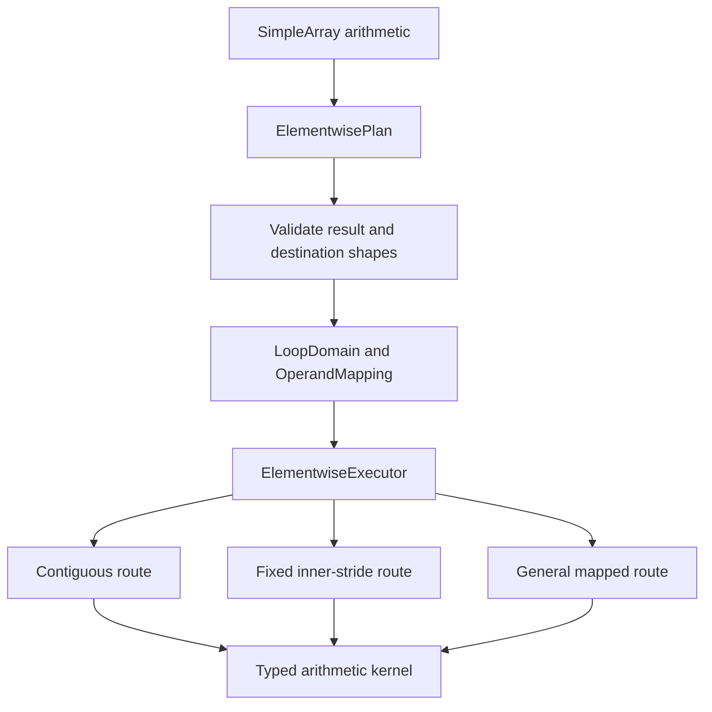

# Add NumPy-compatible elementwise broadcasting with layout-aware execution

<!-- Published as ThreeMonth03/solvcon#23. Keep the file synchronized with that issue. -->

## Motivation

`SimpleArray` arithmetic currently combines validation, traversal, and arithmetic in operation-specific paths. Important routes require equal shapes or assume linear storage, so they cannot express general NumPy broadcasting and cannot safely preserve logical coordinates for every signed, sparse, or zero-stride layout.

NumPy-style elementwise arithmetic should align ranks from the right, broadcast axes of length one, preserve the fixed shape of an in-place destination, and reject incompatible shapes:

```python
lhs.shape == (2, 1, 4)
rhs.shape == (1, 3, 1)

result = lhs + rhs
assert result.shape == (2, 3, 4)
```

Correct broadcasting is not enough. Execution should represent broadcast axes with zero strides, avoid materializing expanded operands, preserve signed and sparse layouts, and select optimized inner loops without coupling traversal policy to each arithmetic operation.

## Current prototype status

[Draft PR #28](https://github.com/ThreeMonth03/solvcon/pull/28) evaluates the design behind private `_planned_add`, `_planned_sub`, `_planned_mul`, and `_planned_div` methods. Private reused-output methods provide a timing control. Existing public arithmetic operators remain unchanged.

The branch is based on `solvcon/solvcon` revision `8337f48a`, which contains [merged PR #1208](https://github.com/solvcon/solvcon/pull/1208) at merge commit `2405ac2b`. The shared `cpp/solvcon/buffer/loop.hpp` remains byte-identical to that base. Elementwise spans, layout classification, planning, alias handling, and route selection remain private to `cpp/solvcon/buffer/elementwise/`.

The final core implementation is revision `0c03661f`. The final Apple data measured clean revision `e4a1bf84`, which adds only the reusable stable timing policy and its tests. Later profiler guard changes correct failure reporting and prevent reused-output measurement after a failed correctness audit; they do not change successful timing order, warmup, sampling, or statistics.

The final macOS gate is complete:

- Apple M1, macOS 26.5.1, native arm64, and AC power
- Python 3.14.6 and **NumPy 2.5.1** with Accelerate
- all five recorded numerical-library thread variables set to 1 before importing NumPy
- 54,432 raw benchmark rows deduplicated in fixed report order to 49,152 unique identifiers, all with overall status `ok`
- 3,134,108 correctness rows with zero unexpected results, benchmark errors, or process crashes
- 256 C++ tests, 1,535 non-GUI Python tests with 1,100 subtests, 34 focused elementwise tests with 285 subtests, and 5 SIMD tests with 48 subtests pass
- the complete lint target and `git diff --check` pass

The WSL2 x86-64 NumPy 2.5.1 broad gate is also complete. Its core implementation is unchanged, so the data remain implementation evidence. WSL2 must rerun the stable policy before its near-parity tails are compared directly with Apple.

## Apple M1 NumPy 2.5.1 evidence

Ratios are NumPy median time divided by planned median time. A value above one means planned execution is faster.

The broad `matched` sweep uses five samples, two warmups, a one-millisecond target, preallocated-output timing, and first-occurrence deduplication. It is used for coverage and tail discovery:

| Scope | Cases | Win rate | Median ratio | 10th percentile | Minimum |
| --- | ---: | ---: | ---: | ---: | ---: |
| All normal paths | 33,368 | 94.49% | 1.480x | 1.093x | 0.211x |
| Broadcast normal paths | 29,208 | 97.38% | 1.500x | 1.138x | 0.211x |
| All reused outputs | 24,512 | 97.56% | 1.865x | 1.146x | 0.323x |
| Broadcast reused outputs | 22,240 | 97.86% | 1.898x | 1.277x | 0.323x |

Near-parity conclusions use the `stable` policy. It runs independent child processes, creates fresh callables each round, performs time-based warmup for every method and round, balances `numpy`, `planned`, `numpy_to`, and `planned_to` across timing positions, and retains every raw observation.

The previously reported tail was `out/mul/float32/n512/all-singleton-rhs/step2-outer/c/none/finite`. The stable run used 7 processes x 9 rounds x 11 samples, a 20-millisecond target, and 50 milliseconds of warmup per method and round. Normal execution has a 1.023x median with a [0.796, 1.281] process-round range. Reused output has a 1.032x median with a [0.715, 1.153] range. Every process-level median is above 1.0 for both paths.

Both paths move together, and operation, dtype, mirrored singleton-side, scaling, and neighboring-layout runs do not isolate a reused-output gap. The old 0.977x result came from fixed-order measurement and is not a stable regression. No core executor or NEON optimization was added because the stable data does not justify architecture complexity for a near-parity effect.

## Correctness evidence

The complete NumPy 2.5.1 catalog contains 3,134,108 rows, all with overall status `ok`. The 1,465,004 planned arithmetic outcomes contain 999,110 value matches, 440,748 expected invalid-broadcast errors, and 25,146 existing complex IEEE division differences. The remaining 1,669,104 comparison rows are unavailable because this prototype implements arithmetic only. Empty domains are included and return before route selection.

## Proposed design

Callers eventually continue to use the existing arithmetic operators. Planning and execution remain internal:



`LoopDomain`, `OperandMapping`, and `MappedOffsetCursor` contain only operation-independent runtime-rank traversal. Broadcast axes use zero strides. `ElementwisePlan` owns arithmetic layout facts and route selection. `ElementwiseExecutor` owns compact output allocation, overlap safety, destination reuse, and dispatch. Typed kernels own arithmetic and hot-loop specialization.

The executor recognizes shared contiguous traversal, fixed inner strides, constant operands, signed contiguous traversal, and a fully general mapped fallback. Partial aliases are snapshotted before execution. Sparse broadcast results use compact storage rather than materialized expanded operands.

## Migration path

The prototype remains behind private staging methods while the architecture is reviewed. The final integration task moves existing public arithmetic and in-place operators to planned execution, removes the private benchmark entry points, and reruns the complete Apple Accelerate and WSL2 gates.

Every abstraction must be consumed by elementwise arithmetic in the task that introduces it. The plan excludes a universal operation object, virtual per-element dispatch, platform-specific planner branches, and shape-specific benchmark routes.

## Implementation outline

- [x] **Task 1: Establish benchmark and correctness coverage.** Generate arithmetic, dtype, topology, layout, alias, empty-axis, and IEEE cases independently from an implementation.
- [x] **Task 2: Separate traversal from arithmetic policy.** Keep the shared loop vocabulary operation-independent and consume it immediately from the elementwise planner.
- [x] **Task 3: Add NumPy broadcast planning.** Rank-align operands, encode broadcast axes with zero strides, and validate fixed in-place destinations.
- [x] **Task 4: Add layout-aware execution.** Select contiguous, fixed inner-stride, constant-operand, signed, and mapped routes without expanding operands.
- [x] **Task 5: Make allocation and aliasing explicit.** Preserve eligible dense layouts, compact sparse outputs, reuse destinations, and snapshot partial overlaps.
- [x] **Task 6: Tune hot loops without changing the planner.** Dispatch Python operands once, reuse direct paths, resolve AArch64 SIMD at compile time, and unroll the shared NEON scalar transform.
- [ ] **Task 7: Replace the legacy public routes.** Move public arithmetic to planned execution, remove private staging methods, and run final cross-platform validation.

## Performance interpretation

Both platforms show a broad advantage over NumPy 2.5.1, especially for broadcast and reused-output execution. The final Apple broad sweep wins 97.38% of broadcast normal cases and 97.86% of broadcast reused-output cases. The balanced Apple tail classifies the old 0.977x point as parity with a small planned median edge. Broad minima and stable round ranges that cross 1.0 still prevent a universal claim.

The architecture should not gain case-specific conditions only to turn every benchmark point into a win. Remaining losses should be evaluated by topology family and stable long-sample evidence.

## Global acceptance

- Planned and eventual public routes match NumPy values for supported arithmetic, dtypes, shapes, broadcasts, and signed or zero-stride layouts, subject to the existing complex IEEE division behavior.
- Empty validated outputs return safely without entering route selection or arithmetic.
- Broadcast mappings use zero strides and do not materialize expanded operands.
- Contiguous and fixed-stride layouts avoid the fully general cursor when their invariants are satisfied.
- Output allocation, exact aliases, partial overlaps, and fixed in-place destination shapes remain correct.
- Timed calls include planning, allocation when applicable, alias handling, dispatch, and arithmetic with thread configuration applied before importing NumPy.
- The final public API contains no `_planned_*` or `_planned_*_to` staging method.
- Final integration requires both Apple Accelerate and WSL2 NumPy 2.5.1 correctness and performance reports.

## Evidence

- [Prototype Draft PR #28](https://github.com/ThreeMonth03/solvcon/pull/28)
- [Final Apple audit comment](https://github.com/ThreeMonth03/solvcon/pull/28#issuecomment-5156411746)
- [Final Apple raw reports, stable observations, logs, checksums, and manifest](https://github.com/user-attachments/files/30628902/elementwise-numpy251-macos-stable-20260802-145103.tar.gz)
- Archive SHA-256: `2592bb0ceed9eeaf9f6c40a92b3c56e9cde6318fc0dc0cafafbbc41b6c7e5cb6`
- [Development plan and reproduction protocol](https://github.com/ThreeMonth03/solvcon/blob/codex/prototype-elementwise-broadcast/doc/source/devplan/elementwise-broadcast-execution/index.md)
- Final Apple measured revision: `e4a1bf847da12c01f250c5b44103f28771011b1d`
- Baseline and final core implementation: `0c03661fe76ad7e01c0c10ffb0c51843c2bdd7b7`
- Existing WSL2 broad evidence revision: `2310734ca0ce8d7cba226b82c0b6ab03df6094fa`

<!-- Publication gate: confirm that Draft PR #28 still targets ThreeMonth03/solvcon:master and remains open. Do not use a closing keyword when posting. -->

<!-- vim: set ft=markdown ff=unix fenc=utf8 et sw=2 ts=2 sts=2 tw=79: -->
