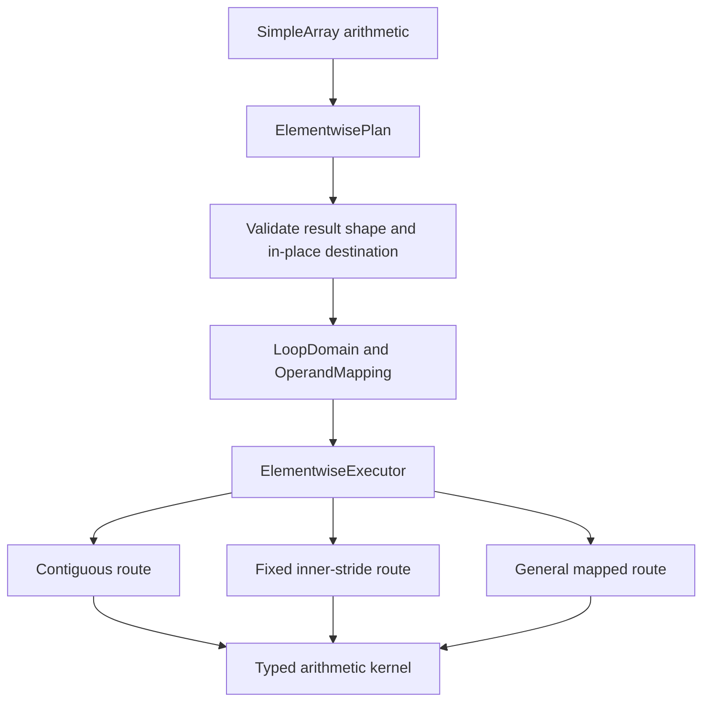

# Add NumPy-compatible elementwise broadcasting with layout-aware execution

<!-- Local upstream issue draft. Keep it unpublished until explicitly approved. -->

## Motivation

`SimpleArray` arithmetic currently combines validation, traversal, and arithmetic in operation-specific paths. Important routes require equal shapes or assume linear storage, so they cannot express general NumPy broadcasting and cannot safely optimize every signed, sparse, or zero-stride layout.

NumPy-style elementwise arithmetic should align ranks from the right, broadcast axes of length one, preserve the fixed shape of an in-place destination, and reject incompatible shapes:

```python
lhs.shape == (2, 1, 4)
rhs.shape == (1, 3, 1)

result = lhs + rhs
assert result.shape == (2, 3, 4)
```

Correct broadcasting is not enough. Execution should represent broadcast axes with zero strides, preserve logical coordinates for negative and sparse layouts, avoid materializing expanded operands, and select optimized inner loops without coupling traversal policy to each arithmetic operation.

## Current prototype status

[Draft PR #28](https://github.com/ThreeMonth03/solvcon/pull/28) evaluates the design behind private `_planned_add`, `_planned_sub`, `_planned_mul`, and `_planned_div` methods, plus private reused-output controls for benchmarking. Existing public arithmetic operators remain unchanged.

The prototype is based on `solvcon/solvcon` revision `8337f48a`, which contains [merged PR #1208](https://github.com/solvcon/solvcon/pull/1208) at merge commit `2405ac2b`. The shared `cpp/solvcon/buffer/loop.hpp` is byte-identical to that base. Elementwise spans, layout classification, planning, alias handling, and route selection remain private to `cpp/solvcon/buffer/elementwise/`.

The current macOS gate is complete:

- Apple M1, macOS 26.5.1, native arm64, and AC power
- Python 3.14.6 and **NumPy 2.5.1** with Accelerate
- all five recorded numerical-library thread variables set to 1 before importing NumPy
- 54,432 raw benchmark rows deduplicated in fixed report order to 49,152 unique identifiers, all with overall status `ok`
- 3,134,108 correctness rows with zero unexpected results, benchmark errors, or process crashes
- 256 C++ tests, 1,535 non-GUI Python tests with 1,100 subtests, 34 focused elementwise tests with 285 subtests, and 5 SIMD tests with 48 subtests pass
- the complete lint target and `git diff --check` pass

The WSL2 x86-64 NumPy 2.5.1 broad gate is also complete. Apple and WSL measurements use the same catalog, report order, deduplication rule, and broad timing policy. Only Apple has run the new stable near-parity policy so far.

## Correctness evidence

The complete NumPy 2.5.1 catalog contains 3,134,108 rows, all with overall status `ok`. The 1,465,004 planned arithmetic outcomes contain 999,110 value matches, 440,748 expected invalid-broadcast errors, and 25,146 existing complex IEEE division differences. The remaining 1,669,104 comparison rows are unavailable because the prototype implements arithmetic only. Empty domains are included and return before route selection.

## Apple M1 NumPy 2.5.1 evidence

The final Apple run measured clean revision `e4a1bf847da12c01f250c5b44103f28771011b1d`. The implementation is byte-identical to `0c03661f` in `cpp/`, `gtests/`, and `solvcon/`; the measured revision only adds the reusable stable timing policy and its tests. Ratios are NumPy median time divided by planned median time.

The broad `matched` sweep retains five samples, two warmups, a one-millisecond target, and preallocated-output timing. It is used for coverage and tail discovery:

| Scope | Cases | Win rate | Median ratio | 10th percentile | Minimum |
| --- | ---: | ---: | ---: | ---: | ---: |
| All normal paths | 33,368 | 94.49% | 1.480x | 1.093x | 0.211x |
| Broadcast normal paths | 29,208 | 97.38% | 1.500x | 1.138x | 0.211x |
| All reused outputs | 24,512 | 97.56% | 1.865x | 1.146x | 0.323x |
| Broadcast reused outputs | 22,240 | 97.86% | 1.898x | 1.277x | 0.323x |

Near-parity conclusions use the new `stable` policy. It runs independent child processes, performs time-based warmup for every method and round, balances all four methods across timing positions, and records raw process, round, order, repeat, and elapsed-time data.

For `out/mul/float32/n512/all-singleton-rhs/step2-outer/c/none/finite`, the LHS shape and strides are `(2, 257, 512)` and `(263168, 512, 1)`. The RHS shape and strides are `(1, 1, 1)` and `(1, 1, 1)`. The long stable run used 7 processes x 9 rounds x 11 samples, a 20-millisecond target, and 50 milliseconds of warmup per method and round. Normal execution has a 1.023x median and [0.796, 1.281] round range. Reused output has a 1.032x median and [0.715, 1.153] round range.

The ranges cross 1.0 for both paths, and operation, dtype, mirrored singleton-side, and neighboring-layout runs do not isolate a reused-output gap. The earlier 0.977x result is a fixed-order artifact, not a stable regression. No core executor or NEON change was made because there is no general, low-risk optimization justified by the stable data.

## WSL2 NumPy 2.5.1 evidence

The clean WSL2 x86-64 run measured revision `2310734ca0ce8d7cba226b82c0b6ab03df6094fa` with Python 3.12.7, one pinned CPU, one thread for every recorded numerical library, five samples, two warmups, and a one-millisecond timing target.

| Scope | Cases | Win rate | Median ratio | 10th percentile |
| --- | ---: | ---: | ---: | ---: |
| All normal paths | 33,368 | 98.23% | 1.800x | 1.295x |
| Broadcast normal paths | 29,208 | 98.14% | 1.829x | 1.374x |
| All reused outputs | 24,512 | 98.91% | 2.284x | 1.385x |
| Broadcast reused outputs | 22,240 | 98.86% | 2.321x | 1.582x |
| Size-32 normal paths | 16,472 | 99.81% | 1.817x | 1.451x |
| Size-32 reused outputs | 12,384 | 99.99% | 2.283x | 1.746x |

Long-sample reruns of the six lowest WSL short-sweep normal ratios range from 0.804x to 1.593x, and three remain below 1.0.

The core implementation did not change after the WSL run, so this remains valid implementation evidence. WSL2 should rerun the new stable timing policy before its near-parity tails are compared directly with the final Apple stable result.

## Proposed design

Callers eventually continue to use the existing arithmetic operators. Planning and execution remain internal:



`LoopDomain`, `OperandMapping`, and `MappedOffsetCursor` contain only operation-independent runtime-rank traversal. Broadcast axes use zero strides. `ElementwisePlan` owns arithmetic layout facts and route selection. `ElementwiseExecutor` owns compact output allocation, overlap safety, destination reuse, and dispatch. Typed kernels own arithmetic and hot-loop specialization.

The executor recognizes shared contiguous traversal, fixed inner strides, constant operands, signed contiguous traversal, and a fully general mapped fallback. Partial aliases are snapshotted before execution. Sparse broadcast results use compact storage rather than materialized expanded operands.

## Migration path

The prototype remains behind private staging methods while the architecture is reviewed. The final integration task moves existing public arithmetic and in-place operators to planned execution, removes private benchmark entry points, and reruns the complete Apple Accelerate and WSL2 gates.

Every abstraction must be consumed by elementwise arithmetic in the task that introduces it. The plan excludes a universal operation object, virtual per-element dispatch, platform-specific planner branches, and shape-specific benchmark routes.

## Implementation outline

- [x] **Task 1: Establish benchmark and correctness coverage.** Generate arithmetic, dtype, topology, layout, alias, empty-axis, and IEEE cases independently from an implementation.
- [x] **Task 2: Separate traversal from arithmetic policy.** Keep the shared loop vocabulary operation-independent and consume it immediately from the elementwise planner.
- [x] **Task 3: Add NumPy broadcast planning.** Rank-align operands, encode broadcast axes with zero strides, and validate fixed in-place destinations.
- [x] **Task 4: Add layout-aware execution.** Select contiguous, fixed inner-stride, constant-operand, signed, and mapped routes without expanding operands.
- [x] **Task 5: Make allocation and aliasing explicit.** Preserve eligible dense layouts, compact sparse outputs, reuse destinations, and snapshot partial overlaps.
- [x] **Task 6: Tune hot loops without changing the planner.** Dispatch Python operands once, reuse direct paths, resolve AArch64 SIMD at compile time, and unroll the shared NEON scalar transform.
- [ ] **Task 7: Replace the legacy public routes.** Move public arithmetic to planned execution, remove private staging methods, and run final cross-platform validation.

## Performance interpretation

Both platforms show a broad advantage over NumPy 2.5.1, especially for broadcast and reused-output execution. The final Apple broad sweep wins 97.38% of broadcast normal cases and 97.86% of broadcast reused-output cases. The balanced Apple tail classifies the old 0.977x point as parity, but broad minima and round ranges that cross 1.0 still prevent a universal claim.

The architecture should not gain case-specific conditions only to turn every benchmark point into a win. Remaining losses should be evaluated by topology family and stable long-sample evidence.

## Global acceptance

- Planned and eventual public routes match NumPy values for supported arithmetic, dtypes, shapes, broadcasts, and signed or zero-stride layouts, subject to the existing complex IEEE division behavior.
- Empty validated outputs return safely without entering route selection or arithmetic.
- Broadcast mappings use zero strides and do not materialize expanded operands.
- Contiguous and fixed-stride layouts avoid the fully general cursor when their invariants are satisfied.
- Output allocation, exact aliases, partial overlaps, and fixed in-place destination shapes remain correct.
- Timed calls include planning, allocation when applicable, alias handling, dispatch, and arithmetic with thread configuration applied before importing NumPy.
- The final public API contains no `_planned_*` or `_planned_*_to` staging method.
- Final integration requires both Apple Accelerate and WSL2 NumPy 2.5.1 correctness and performance reports.

## Evidence

- [Prototype draft PR #28](https://github.com/ThreeMonth03/solvcon/pull/28)
- [Development plan, detailed results, and reproduction protocol](https://github.com/ThreeMonth03/solvcon/blob/codex/prototype-elementwise-broadcast/doc/source/devplan/elementwise-broadcast-execution/index.md)
- Final Apple audit comment and immutable archive: attached to Draft PR #28
- Measured Apple revision: `e4a1bf847da12c01f250c5b44103f28771011b1d`
- Baseline and final core implementation revision: `0c03661fe76ad7e01c0c10ffb0c51843c2bdd7b7`
- Measured WSL2 code revision: `2310734ca0ce8d7cba226b82c0b6ab03df6094fa`

<!-- Publication gate: confirm that Draft PR #28 still targets ThreeMonth03/solvcon:master and remains open. Do not use a closing keyword when posting upstream. -->

<!-- vim: set ft=markdown ff=unix fenc=utf8 et sw=2 ts=2 sts=2 tw=79: -->
