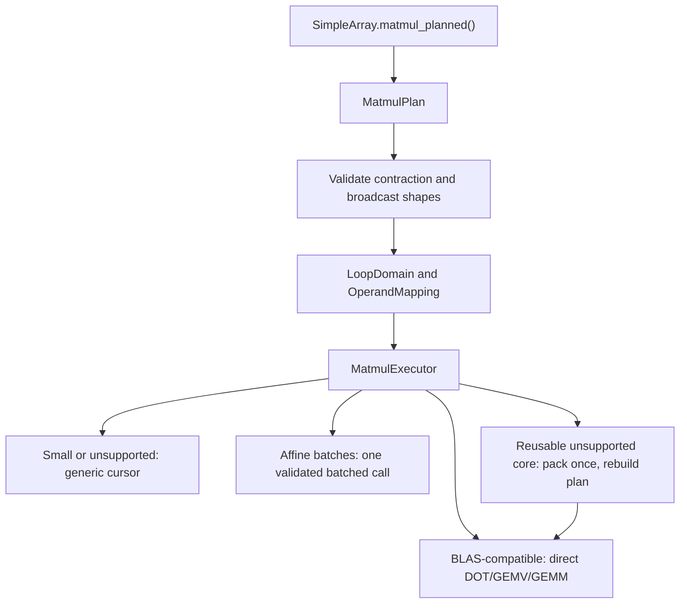

# Layout-aware matmul execution

## Problem

The earlier prototype mixed shape inference, broadcasting, address
calculation, packing, and arithmetic in one large execution layer. That made
the hot path hard to reason about and encouraged one-off dispatch decisions.

This prototype starts from the small broadcast planning stack and adds matmul
as a consumer. It keeps validation and iteration independent from the
arithmetic backend. The public experiment remains
`SimpleArray.matmul_planned()` so the existing matmul methods do not change.

The performance target is NumPy 2.5.1 on an Apple M1. Contiguous inputs should
stay at parity, while layouts that BLAS cannot consume directly should benefit
from signed-stride execution or pack-once dispatch.

## Code analysis

The implementation is split across the following files:

- `cpp/solvcon/buffer/loop.hpp` describes a broadcast loop domain, maps each
  operand into that domain, and advances signed or zero-stride offsets.
- `cpp/solvcon/buffer/matmul.hpp` validates the contraction, assigns vector
  and matrix roles, constructs the output shape, and selects an executor
  route.
- `cpp/solvcon/math/blas_compat.hpp` and
  `cpp/solvcon/math/blas_compat.cpp` provide checked DOT, GEMV, and GEMM
  wrappers, including affine batched calls.
- `cpp/solvcon/buffer/SimpleArray.cpp` copies contiguous inner rows as streams.
  The same copy path supports packing for every array user.
- `profiling/profile_matmul_cartesian.py` validates the layout catalog.
- `profiling/profile_matmul_prototype.py` runs the performance catalog.
- `profiling/render_matmul_prototype.py` renders the raw JSON reports.

## Design

`MatmulPlan` owns semantic facts. It records whether each operand is a vector
or matrix, the contraction sizes, the broadcast batch shape, and three batch
mappings. It does not choose a kernel.

`MatmulExecutor` owns layout and cost decisions. Its routes are:

1. Use the mapped scalar loop for small work or unsupported scalar types.
2. Call DOT, GEMV, or GEMM directly when core strides are BLAS-compatible.
3. Collapse an affine inner batch axis into one checked batched BLAS call.
4. Copy an unsupported core layout once when enough contractions reuse it,
   rebuild the plan for the packed operand, and use the normal direct route.

There is no platform branch and no benchmark-only entry point. Negative,
step-2, zero-stride, Fortran-core, and broadcast layouts all enter through the
same planner.

## Implementation

The stacked branch history separates the concerns:

| Commit | Purpose |
| --- | --- |
| `0ec98631` | Traverse equal batch shapes. |
| `e435f930` | Add broadcast batch mappings. |
| `b4a64e7c` | Complete vector and matrix operand roles. |
| `c399ee5e` | Dispatch planned contractions through BLAS. |
| `64c77e45` | Stream contiguous rows during general array copies. |
| `d17b1e6c` | Add correctness and benchmark catalogs. |
| `66d6d03e` | Hoist affine strided batched GEMV dispatch. |

The last two performance changes are intentionally general:

- Row streaming improves the existing array copy operation and therefore the
  pack-once route. It is not tied to matmul.
- Affine batched GEMV uses the batch stride already computed by the plan. It
  avoids repeated wrapper validation for C, Fortran, negative, and step-2
  batch layouts.

## NumPy 2.5.1 path change

NumPy 2.2.4 sent a matrix-matrix contraction to
`matmul_inner_noblas` when either matrix core could not be represented by its
BLAS stride checks. NumPy 2.5.1 instead allocates a reusable temporary region,
copies a non-BLAS core into that region for each outer iteration, and calls
GEMM. It copies a non-BLAS output back afterward.

This source change explains why the old negative-inner broadcast result cannot
be reused. For `(1, 256, 256) @ (64, 256, 256)`, the NumPy median changed from
about 1997 ms with NumPy 2.2.4 to 14.650 ms with NumPy 2.5.1 on this machine.
The current prototype takes 11.902 ms.

The relevant upstream references are the
[NumPy non-contiguous matmul issue](https://github.com/numpy/numpy/issues/23588),
the [2.2.4 matmul source](https://github.com/numpy/numpy/blob/v2.2.4/numpy/_core/src/umath/matmul.c.src),
and the [2.5.1 matmul source](https://github.com/numpy/numpy/blob/v2.5.1/numpy/_core/src/umath/matmul.c.src).

## Verification

The measured code revision is `66d6d03ef7ceabfb4f002176bffa1c73c28f3f36`.
The environment is:

| Item | Value |
| --- | --- |
| Machine | Apple M1 |
| OS | macOS 26.5.1 arm64 |
| Python | 3.14.6 |
| NumPy | 2.5.1 |
| Samples | 15 |
| Warmups | 5 |
| Timing target | 20 ms per sample |
| Numerical library threads | 1 |

Planning, allocation, packing, binding dispatch, and arithmetic are included.
Method order alternates and every method is calibrated separately.

Correctness and tests:

- The Cartesian catalog passed 31,825 of 31,825 layout combinations.
- The focused Python run passed 271 tests and 566 subtests.
- The C++ run passed 236 tests from 55 suites.
- No unexpected correctness result was observed.

### Aggregate performance

Ratios are NumPy median time divided by planned median time. A value above one
means the prototype is faster.

| Group | Cases | Median ratio | At least 1 | Minimum | Maximum |
| --- | ---: | ---: | ---: | ---: | ---: |
| Core matrix | 96 | 1.056x | 77/96 | 0.873x | 2.126x |
| Broadcast scaling | 120 | 1.303x | 104/120 | 0.986x | 5.686x |
| Pack crossover | 1080 | 1.056x | 754/1080 | 0.912x | 19.596x |
| Vector threshold | 80 | 1.002x | 45/80 | 0.942x | 1.088x |
| Rectangular vector | 270 | 2.266x | 263/270 | 0.962x | 8.531x |

The broadcast result separates the intended behavior:

| Core layout | Cases | Median ratio | Minimum |
| --- | ---: | ---: | ---: |
| C contiguous | 40 | 1.003x | 0.986x |
| Negative | 40 | 1.878x | 1.274x |
| Step-2 | 40 | 1.526x | 1.062x |

Every negative and step-2 broadcast-scaling case is faster than NumPy 2.5.1.
The C-contiguous cases are at parity. The remaining sub-one points occur in
small-call or marginal packing crossovers, not the broadcast paths that
motivated the prototype.

### Targeted broadcast reuse

This table uses float64 `(1, 256, 256) @ (64, 256, 256)`.

| Layout | NumPy | Planned | NumPy prepacked | Planned prepacked |
| --- | ---: | ---: | ---: | ---: |
| Dense | 12.078 ms | 11.845 ms | 12.032 ms | 11.813 ms |
| Negative inner | 14.650 ms | 11.902 ms | 12.022 ms | 11.910 ms |

The dense ratio is 1.020x and the negative-inner ratio is 1.231x.

### Optimization control

Hoisting the affine batched GEMV route changed the 1,080-case pack crossover
catalog as follows:

| Revision | Median ratio | At least 1 | Minimum |
| --- | ---: | ---: | ---: |
| Before `66d6d03e` | 1.041x | 677/1080 | 0.756x |
| `66d6d03e` | 1.056x | 754/1080 | 0.912x |

The remaining worst point is an `nd-1d` row-step-2 matrix at side 256 and
batch 16: NumPy takes 315.399 us and planned takes 345.900 us. Prepacking the
same contraction makes planned arithmetic 1.134x faster, but copying the full
matrix in every call costs more than it saves. A special branch for that
single crossover would make the architecture less predictable.

## Out of scope

- The existing `matmul()`, `matmul_blas()`, and `matmul_fast()` behavior is
  unchanged.
- Elementwise and reduction execution are not folded into this prototype.
- Reusable output or cached plan APIs are not introduced.
- WSL measurements are deferred until the macOS prototype review is complete.

## Delivery status

- Branch: `codex/prototype-layout-aware-execution`
- Benchmark revision: `66d6d03ef7ceabfb4f002176bffa1c73c28f3f36`
- macOS implementation, correctness, and NumPy 2.5.1 profiling: complete
- Draft PR and fork issue rewrite: pending the final push
- WSL profiling: pending
- Documentation preview: not served because no trusted network address was
  requested

## Chat history

| User request | Effect on the prototype |
| --- | --- |
| Reproduce the batched matmul work like the elementwise report. | Added fixed-protocol macOS reports and raw JSON. |
| Upgrade the prime environment data to NumPy 2.5.1. | Re-ran all current reports with NumPy 2.5.1. |
| Explain the NumPy 2.2.4 and 2.5.1 contiguous difference. | Separated version effects from solvcon changes. |
| Rebase the equal-batch PR and its broadcast stack. | Rebuilt one linear stack on the current upstream master. |
| Replace the old large prototype with a SOLID architecture. | Kept planning, iteration, dispatch, and packing separate. |
| Optimize losing NumPy 2.5.1 paths, then rewrite the drafts. | Added pack-once BLAS, row streaming, affine batched GEMV, and this report. |
| Leave WSL until macOS is complete. | Marked WSL as a later validation stage. |

<!-- vim: set ft=markdown ff=unix fenc=utf8 et sw=2 ts=2 sts=2 tw=79: -->
