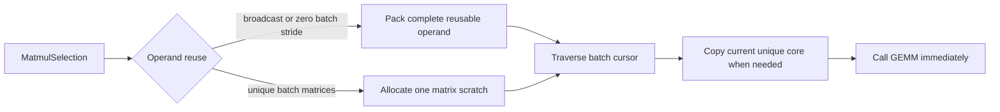

# Stream unique strided matrices into batched GEMM

## Problem

A BLAS-incompatible broadcast matrix can be packed once and reused. A unique
batch such as `(10,16,16) @ (10,16,16)` is different: every matrix core has
different values. Materializing both complete batches before GEMM copies the
right amount of data but retains two extra batch-sized arrays and delays all
contractions until both copies finish.

On Apple M1, the existing float64 both-negative case measured 16.77 us for
`matmul_planned()` and 14.03 us for NumPy. This prototype tests whether one
reusable matrix scratch per incompatible operand removes that gap.

## Design



`MatmulPlan` remains unchanged. It still owns batch mappings and signed matrix
strides. `MatmulSelection` records complete and streamed packing separately.
The executor may therefore combine both forms: a broadcast operand is packed
once, while a unique incompatible operand is copied through one scratch matrix
inside the same batch traversal.

For `(10,M,K) @ (10,K,N)`, streaming allocates at most one `(M,K)` and one
`(K,N)` scratch matrix. It still copies ten lhs and ten rhs cores, but it does
not retain complete packed batches. BLAS descriptors are classified once;
inside the loop only data pointers change.

## Implementation

The implementation lives in `cpp/solvcon/buffer/matmul.hpp`:

- `select_gemm()` assigns complete packing to reusable operands and streamed
  packing to unique operands.
- `execute_streamed_gemm()` traverses `MappedOffsetCursor`, copies the current
  incompatible core, and calls GEMM immediately.
- `copy_matrix_core()` supports positive, negative, and step-two signed
  strides without constructing temporary views.

The Python test uses C-contiguous, negative-stride, and step-two matrix cores
at side 21. This size bypasses the fixed small-matrix kernels and exercises
the packing decision for float and complex arrays.

## WSL verification

Ubuntu/WSL2 used GCC 16, Python 3.12.7, NumPy 2.5.1, and single-threaded
OpenBLAS. Each row is the median of 49 timed calls after two warmups per round.
The inputs have lhs element strides `(S*S,S,-1)` and rhs element strides
`(S*S,-S,1)`.

| dtype | input shape | complete batch packing | streamed packing | NumPy |
| --- | --- | ---: | ---: | ---: |
| float64 | `(2,16,16) @ (2,16,16)` | 2.618 us | 2.313 us | 2.472 us |
| float64 | `(10,16,16) @ (10,16,16)` | 8.732 us | 7.514 us | 8.275 us |
| float64 | `(32,16,16) @ (32,16,16)` | 24.310 us | 21.470 us | 22.850 us |
| float64 | `(10,32,32) @ (10,32,32)` | 32.550 us | 30.600 us | 31.170 us |
| float64 | `(10,64,64) @ (10,64,64)` | 162.100 us | 149.500 us | 153.300 us |
| float64 | `(10,256,256) @ (10,256,256)` | 9.815 ms | 6.540 ms | 6.692 ms |

The profiler covers batch sizes 2, 10, and 32; sides 16, 32, 64, and 256;
float32 and float64; and the Cartesian product of C-contiguous,
negative-stride, and step-two operands. Run it with:

```console
make CMAKE_BUILD_TYPE=Release SOLVCON_PROFILE=ON BUILD_QT=OFF
OPENBLAS_NUM_THREADS=1 OMP_NUM_THREADS=1 python3 \
    profiling/profile_matrix_ops.py --suite streamed-gemm \
    --warmups 2 --samples 7 --rounds 7
```

The same command is the macOS decision gate. Accelerate may move the boundary
between complete and streamed packing. On macOS, replace the OpenBLAS setting
with `VECLIB_MAXIMUM_THREADS=1`. This draft does not add a new tuning threshold
before those measurements exist.

## Out of scope

This prototype does not change broadcasting, batch-offset planning, fixed
small-matrix kernels, vector-matrix routes, or the public Python API. It does
not pack the complete unique batch into a second layout.

## Delivery status

- Branch: `prototype/streamed-batched-gemm`
- Correctness: targeted Python test passes for all four supported matmul dtypes
- Profiling: WSL base, prototype, and NumPy comparison completed
- macOS Accelerate profiling: pending

## Conversation notes

- The request to verify streamed packing before filing an issue led to the
  paired complete-versus-streamed benchmark.
- The request for a fork draft that macOS can reproduce led to the focused
  profiler suite and explicit command above.

<!-- vim: set ft=markdown ff=unix fenc=utf8 et sw=2 ts=2 sts=2 tw=79: -->
